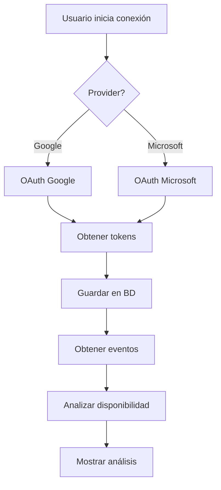

# STUDY-PLANNER.md

Esta documentación proporciona una guía completa sobre el **Planificador de Estudios (Study Planner)** del proyecto, detallando su arquitectura, flujo conversacional, integración con LIA, y mejores prácticas implementadas.

---

## 📋 Índice

1. [Visión General](#visión-general)
2. [Arquitectura del Feature](#arquitectura-del-feature)
3. [Flujo Conversacional con LIA](#flujo-conversacional-con-lia)
4. [Modos de Sesión y Distribución](#modos-de-sesión-y-distribución)
5. [Integración con Calendario](#integración-con-calendario)
6. [Servicios Principales](#servicios-principales)
7. [Tipos y Validaciones](#tipos-y-validaciones)
8. [API Routes](#api-routes)
9. [Mejores Prácticas de Estudio](#mejores-prácticas-de-estudio)
10. [Perfiles B2B vs B2C](#perfiles-b2b-vs-b2c)
11. [Tablas de Base de Datos](#tablas-de-base-de-datos)
12. [Guía de Desarrollo](#guía-de-desarrollo)

---

## Visión General

### Propósito

El **Planificador de Estudios** personaliza la experiencia de aprendizaje mediante:
- **Configuración Manual**: Usuario configura su plan considerando tiempos mínimos por lección
- **Generación Automática con IA (LIA)**: LIA genera plan automático basado en múltiples factores
- **Sistema de Validaciones**: Tiempo mínimo = duración completa de lección
- **Integración Automática**: Calendarios externos (Google Calendar, Microsoft Outlook)

### Ubicación en el Proyecto

```
apps/web/src/features/study-planner/
├── components/          # Componentes UI del planificador
│   ├── StudyPlannerLIA.tsx          # Componente principal con LIA
│   ├── CalendarConnection.tsx       # Conexión de calendarios
│   ├── PlanSummary.tsx             # Resumen del plan
│   └── StudyPlannerCalendar.tsx    # Vista de calendario
├── hooks/               # Hooks personalizados
│   ├── useStudyPlannerLIA.ts       # Hook principal del flujo con LIA
│   └── useStudyPlannerDashboardLIA.ts  # Hook para dashboard
├── services/            # Servicios de lógica de negocio
│   ├── user-context.service.ts      # Contexto del usuario
│   ├── calendar-integration.service.ts  # Integración de calendarios
│   ├── lia-context.service.ts       # Contexto para LIA
│   ├── validation.service.ts        # Validaciones
│   ├── course-analysis.service.ts   # Análisis de cursos
│   └── [otros 12 servicios]
├── context/             # Contexto React del planificador
├── types/               # Tipos TypeScript
├── utils/               # Utilidades
├── prompts/             # Prompts de LIA
├── migrations/          # Migraciones de datos
├── LIA_LOGIC_FLOW.md   # Documentación de lógica LIA
└── index.ts            # Exports del módulo

API Routes:
apps/web/src/app/api/
├── study-planner-chat/route.ts           # Chat con LIA
├── study-planner/
│   ├── analyze/route.ts                  # Análisis de contexto
│   ├── generate-plan/route.ts            # Generación de plan
│   └── save-plan/route.ts               # Guardar plan
└── calendar/
    ├── connect/route.ts                  # Conectar calendario
    └── availability/route.ts             # Disponibilidad
```

### Tecnologías Clave

- **Frontend**: React 18, TypeScript, Next.js 14
- **IA**: OpenAI GPT-4o-mini (LIA)
- **Calendario**: Google Calendar API, Microsoft Graph API
- **Database**: Supabase (PostgreSQL)
- **State**: React Context + Zustand

---

## Arquitectura del Feature

### Estructura de Componentes

```
StudyPlannerLIA (Componente Principal)
├── useStudyPlannerLIA (Hook)
│   ├── Fase 0: Bienvenida
│   ├── Fase 1: Análisis de Contexto
│   ├── Fase 2: Selección de Cursos
│   ├── Fase 3: Integración con Calendario
│   ├── Fase 4: Configuración de Tiempos
│   ├── Fase 5: Tiempos de Descanso
│   ├── Fase 6: Días y Horarios
│   └── Fase 7: Resumen y Confirmación
├── CalendarConnection (Componente)
├── PlanSummary (Componente)
└── StudyPlannerCalendar (Componente)
```

### Capas de Servicio

| Servicio | Responsabilidad |
|----------|-----------------|
| `user-context.service.ts` | Obtener perfil profesional completo del usuario |
| `course-analysis.service.ts` | Analizar cursos asignados/adquiridos |
| `calendar-integration.service.ts` | Conectar y analizar calendarios externos |
| `lia-context.service.ts` | Construir contexto para prompts de LIA |
| `validation.service.ts` | Validar configuración del plan |
| `plan-generator.service.ts` | Generar plan de estudios |
| `session-generator.service.ts` | Generar sesiones individuales |
| `availability-calculator.service.ts` | Calcular disponibilidad según perfil |
| `lesson-time.service.ts` | Calcular duración de lecciones |
| `study-strategy.service.ts` | Estrategias de estudio personalizadas |

### Dependency Flow

```
Components → Hooks → Services → Supabase + External APIs
   ↓          ↓         ↓
Context ← Validation ← LIA Context
```

---

## Flujo Conversacional con LIA

El planificador sigue un flujo conversacional guiado por LIA en **7 fases**:

### Fase 0: Bienvenida

**Objetivo:** Introducir a LIA y explicar el proceso.

**Acciones:**
- Saludar al usuario por nombre
- Explicar capacidades del planificador
- Mencionar si el plan será automático o manual
- Preparar al usuario para el proceso

### Fase 1: Análisis de Contexto

**Objetivo:** Analizar el perfil profesional y estimar disponibilidad.

**Datos obtenidos:**
- Rol profesional (CEO, Gerente, Miembro de equipo, etc.)
- Tamaño de empresa (1-50, 51-250, 251-1000, 1000+)
- Área profesional (Marketing, TI, Finanzas, etc.)
- Nivel jerárquico
- Sector de industria
- Tipo de usuario (B2B/B2C)

**Acciones de LIA:**
1. Obtener perfil completo desde BD
2. Identificar tipo de usuario (B2B/B2C)
3. **Usar IA generativa** para estimar disponibilidad basándose en:
   - Rol profesional (C-Level tiene menos tiempo)
   - Tamaño de empresa (más empleados = menos tiempo)
   - Área profesional
   - Nivel jerárquico
4. Presentar análisis al usuario
5. Confirmar si el análisis es correcto

**SQL para obtener perfil:**
```sql
SELECT 
  u.id, u.email, u.username,
  COALESCE(u.type_rol, r.nombre, up.cargo_titulo, 'Usuario') as rol_profesional,
  r.slug as rol_slug,
  a.nombre as area_nombre,
  te.nombre as tamano_empresa,
  te.min_empleados, te.max_empleados,
  n.nombre as nivel_nombre,
  s.nombre as sector_nombre,
  rel.nombre as relacion_nombre
FROM users u
LEFT JOIN user_perfil up ON u.id = up.user_id
LEFT JOIN roles r ON up.rol_id = r.id
LEFT JOIN areas a ON COALESCE(up.area_id, r.area_id) = a.id
LEFT JOIN tamanos_empresa te ON up.tamano_id = te.id
LEFT JOIN niveles n ON up.nivel_id = n.id
LEFT JOIN sectores s ON up.sector_id = s.id
LEFT JOIN relaciones rel ON up.relacion_id = rel.id
WHERE u.id = $1;
```

### Fase 2: Selección de Cursos

**Objetivo:** Definir qué cursos incluir en el plan.

**Flujo B2B:**
1. Obtiene cursos de `organization_course_assignments`
2. Presenta cursos con sus plazos
3. Destaca cursos con plazos próximos
4. Sugiere priorización
5. NO pregunta por otros cursos

**Flujo B2C:**
1. Muestra cursos de `course_purchases`
2. Pregunta cuáles incluir
3. Opcionalmente sugiere rutas de aprendizaje
4. Puede sugerir cursos adicionales no adquiridos
5. Confirma selección final

### Fase 3: Integración con Calendario

**Objetivo:** Conectar y analizar el calendario del usuario.

**⚠️ REGLA CRÍTICA:** Esta fase es OBLIGATORIA antes de estimar tiempos.

**Acciones:**
1. Verificar si hay calendario conectado
2. Si no está conectado:
   - Solicitar conexión (Google Calendar o Microsoft Outlook)
   - Explicar beneficios
   - Esperar conexión
3. Una vez conectado:
   - Obtener eventos (próximas 2 semanas)
   - Analizar disponibilidad
   - Identificar patrones (mañanas ocupadas, etc.)
4. Presentar análisis de disponibilidad

**Providers soportados:**
- Google Calendar
- Microsoft Outlook/Office 365

### Fase 4: Configuración de Tiempos

**Objetivo:** Establecer tiempos mínimos y máximos de sesiones.

**⚠️ REGLA CRÍTICA:** Tiempo mínimo >= duración de lección más corta.

**Acciones de LIA:**
1. Calcular duración de lección más corta de los cursos seleccionados
2. Considerar análisis de calendario
3. Sugerir tiempos basándose en:
   - Disponibilidad del calendario
   - Perfil profesional
   - Complejidad de cursos
4. Para B2B: Validar que tiempos permitan cumplir plazos
5. Presentar sugerencias
6. Permitir ajustes del usuario
7. Validar ajustes

**Validaciones:**
```typescript
// Tiempo mínimo >= lección más corta
if (minSessionMinutes < minimumLessonTime) {
  error("El tiempo mínimo debe permitir completar al menos una lección");
}

// Para B2B: verificar plazos
if (userType === 'b2b') {
  const canMeetDeadlines = validateB2BDeadlines(courses, weeklyStudyMinutes);
  if (!canMeetDeadlines) {
    warning("Los tiempos configurados no permiten cumplir los plazos");
    suggestAlternatives();
  }
}
```

### Fase 5: Tiempos de Descanso

**Objetivo:** Calcular tiempos de descanso óptimos.

**Técnica Pomodoro implementada:**
- Sesiones 20-35 min: 5 min descanso
- Sesiones 45-60 min: 10 min descanso
- Sesiones 75-120 min: 15-20 min descanso

**Acciones:**
1. Analizar duración de sesiones configurada
2. Calcular descanso óptimo usando IA
3. Explicar razonamiento
4. Permitir ajustes del usuario

### Fase 6: Días y Horarios

**Objetivo:** Configurar cuándo estudiar.

**Acciones:**
1. Preguntar días preferidos (Lun-Dom)
2. Preguntar horarios:
   - Opción genérica: mañana/tarde/noche
   - Opción específica: horas:minutos exactos
3. Validar contra:
   - Disponibilidad del calendario
   - Tiempos mínimos/máximos configurados
   - Tiempos de descanso
4. Si hay conflictos, sugerir alternativas

### Fase 7: Resumen y Confirmación

**Objetivo:** Presentar plan completo y obtener confirmación.

**Acciones:**
1. Generar resumen completo:
   - Información del usuario
   - Cursos incluidos
   - Tiempos de sesión
   - Tiempos de descanso
   - Días y horarios
   - Plazos (B2B)
   - Estimaciones (semanas, sesiones, horas totales)
2. Mostrar advertencias si hay
3. Ofrecer opción de modificar
4. Si el usuario acepta:
   - Generar sesiones
   - Guardar plan en BD
   - Crear eventos de calendario

---

## Modos de Sesión y Distribución

> **Última Actualización:** 10/02/2026 - Implementación del Greedy Algorithm V2

### Semántica de Modos (INTERPRETACIÓN A)

Los modos de sesión controlan la **velocidad de completación del curso**, NO solo la duración de las sesiones:

| Modo Interno | Nombre en UI | Velocidad | Duración Sesión | Días para completar |
|-------------|--------------|-----------|-----------------|---------------------|
| `corto` | **Terminar rápido** | RÁPIDO | 60-90 min | MENOS días |
| `balance` | **Equilibrado** | NORMAL | 45-60 min | MODERADO |
| `largo` | **Sin prisa** | LENTO | 20-35 min | MÁS días |

### Lógica Implementada por Modo

**Modo `corto` (Terminar rápido):**
- Sesiones largas de 60-90 minutos
- Sin límite de grupos de lecciones por slot (`maxGroupsPerSlot = 999`)
- Llenar cada slot al máximo para avanzar más por día
- Descansos de 15 minutos

**Modo `balance` (Equilibrado):**
- Sesiones medianas de 45-60 minutos
- Máximo 3 grupos de lecciones por slot
- Distribución balanceada
- Descansos de 10 minutos

**Modo `largo` (Sin prisa):**
- Sesiones cortas de 20-35 minutos
- Máximo 2 grupos de lecciones por slot
- Saltar slots para distribuir a lo largo del período (`skipSlots > 0`)
- Descansos de 5 minutos

### Algoritmo de Distribución (Greedy Algorithm)

**Ubicación:** `apps/web/src/features/study-planner/components/StudyPlannerLIA.tsx`

**Entradas:**
- `slotsUntilTarget`: Lista de días/bloques de tiempo disponibles en el calendario
- `validPendingLessons`: Lista ordenada de lecciones pendientes
- `studyApproach`: `'corto'`, `'balance'`, o `'largo'`

**Proceso:**

1. **Determinar Parámetros según Modo:**
```typescript
// Modo corto (Terminar rápido):
maxSessionMinutes = 90; maxGroupsPerSlot = 999; skipSlots = 0;

// Modo balance (Equilibrado):
maxSessionMinutes = 60; maxGroupsPerSlot = 3; skipSlots = 0;

// Modo largo (Sin prisa):
maxSessionMinutes = 35; maxGroupsPerSlot = 2; skipSlots = calculado;
```

2. **Asignación Voraz (Greedy):**
   - El sistema itera por cada **Slot** de tiempo disponible
   - Respeta el límite `maxGroupsPerSlot` según el modo
   - Para modo `largo`, salta slots para distribuir mejor
   - **Regla de Encaje:** Lección cabe si `Tiempo Usado + Duración <= Capacidad del Slot`

3. **Fallback de Capacidad:**
   - Si `capacityRatio < 1.3`, ignora restricciones del modo y usa todos los slots

**Salida:**
- Objeto `lessonDistribution` con lista de lecciones por día

### Comunicación con LIA

**Formato del Mensaje (`calendarMessage`):**

El Frontend construye un mensaje que inyecta en el contexto de la conversación:

```text
📅 Lunes 25/12
  • ⏰ HORARIO EXACTO: 09:00 - 09:15 (15 min) - [Curso A] Lección 1
  • ⏰ HORARIO EXACTO: 09:15 - 09:30 (15 min) - [Curso A] Lección 2
```

**⚠️ CRÍTICO:** El prefijo `⏰ HORARIO EXACTO` es el disparador para que LIA respete los tiempos.

### Reglas del Sistema (Prompt)

**Ubicación:** `apps/web/src/app/api/study-planner-chat/route.ts`

**Reglas de Oro:**
1. **Copiar Literal:** Si ve `HORARIO EXACTO: HH:mm - HH:mm`, DEBE responder con esos mismos tiempos
2. **Prohibido Redondear:** La IA no puede redondear a intervalos de 15/30 min si el horario es diferente
3. **Manejo de Errores:** Si no hay suficientes slots, sugerir "extender fecha objetivo" o "liberar más tiempo"

---

## Integración con Calendario

### Providers Soportados

- **Google Calendar** (Google Calendar API v3)
- **Microsoft Outlook** (Microsoft Graph API)

### Flujo de Conexión



### Endpoints

| Endpoint | Método | Propósito |
|----------|--------|-----------|
| `/api/calendar/connect` | POST | Iniciar OAuth y conectar calendario |
| `/api/calendar/availability` | GET | Obtener disponibilidad analizada |
| `/api/study-planner/calendar/analyze` | POST | Analizar eventos y disponibilidad |

### Datos Obtenidos del Calendario

```typescript
interface CalendarEvent {
  id: string;
  title: string;
  start: Date;
  end: Date;
  isAllDay: boolean;
  calendarId: string;
}

interface CalendarAvailability {
  freeSlots: TimeBlock[];
  busyPatterns: {
    mornings: number;  // % ocupación mañanas
    afternoons: number; // % ocupación tardes
    evenings: number;   // % ocupación noches
  };
  recommendedTimes: TimeOfDay[];
}
```

### Sincronización con Calendario

Cuando se guarda un plan, automáticamente se crean eventos en el calendario externo:

```typescript
// En save-plan API route
const calendarEvents = await createCalendarEvents(
  studyPlan.sessions,
  user.calendarProvider,
  user.calendarAccessToken
);
```

---

## Servicios Principales

### UserContextService

**Archivo:** `services/user-context.service.ts`

**Responsabilidad:** Obtener contexto completo del usuario

**Métodos principales:**
```typescript
getUserContext(userId: string): Promise<UserContext>
// Obtiene:
// - Perfil profesional
// - Organización (si B2B)
// - Cursos asignados/adquiridos
// - Preferencias de estudio
// - Calendario conectado

getProfessionalProfile(userId: string): Promise<UserProfessionalProfile>
// Obtiene perfil granular con rol, área, tamaño empresa, etc.
```

### CourseAnalysisService

**Archivo:** `services/course-analysis.service.ts`

**Responsabilidad:** Analizar cursos y lecciones

**Métodos principales:**
```typescript
getCourseInfo(courseIds: string[]): Promise<CourseInfo[]>
// Obtiene información de cursos con módulos y lecciones

analyzeCourseComplexity(course: CourseInfo): CourseComplexity
// Analiza:
// - Nivel de dificultad (beginner, intermediate, advanced)
// - Categoría (técnica, conceptual, práctica, teórica)
// - Duración total
// - Número de lecciones

calculateMinimumLessonTime(courses: CourseInfo[]): number
// Calcula duración de la lección más corta
```

### CalendarIntegrationService

**Archivo:** `services/calendar-integration.service.ts`

**Responsabilidad:** Integrar con calendarios externos

**Métodos principales:**
```typescript
connectCalendar(userId: string, provider: CalendarProvider): Promise<OAuthUrl>
// Inicia flujo OAuth

getCalendarEvents(userId: string, startDate: Date, endDate: Date): Promise<CalendarEvent[]>
// Obtiene eventos del calendario

analyzeAvailability(events: CalendarEvent[]): CalendarAvailability
// Analiza disponibilidad en base a eventos

createStudySessionEvents(sessions: StudySession[], provider: CalendarProvider): Promise<void>
// Crea eventos en calendario externo
```

### LiaContextService

**Archivo:** `services/lia-context.service.ts`

**Responsabilidad:** Construir contexto para prompts de LIA

**Métodos principales:**
```typescript
buildContextForPhase(phase: StudyPlannerPhase, data: PhaseData): StudyPlannerLIAContext
// Construye contexto específico para cada fase

formatProfessionalProfile(profile: UserProfessionalProfile): string
// Formatea perfil en texto para LIA

formatCourseList(courses: CourseInfo[]): string
// Formatea lista de cursos para LIA

formatCalendarAnalysis(availability: CalendarAvailability): string
// Formatea análisis de calendario para LIA
```

### ValidationService

**Archivo:** `services/validation.service.ts`

**Responsabilidad:** Validar configuración del plan

**Métodos principales:**
```typescript
validateSessionTimes(minTime: number, maxTime: number, minimumLessonTime: number): ValidationResult
// Valida tiempos de sesión

validateB2BDeadlines(courses: CourseInfo[], weeklyMinutes: number, targetDate: Date): DeadlineValidation
// Valida si se pueden cumplir plazos B2B

validateTimeBlocks(blocks: TimeBlock[], minSessionTime: number): ValidationResult
// Valida bloques de tiempo configurados

validateCalendarConflicts(sessions: StudySession[], calendarEvents: CalendarEvent[]): ValidationResult
// Valida conflictos con calendario
```

---

## Tipos y Validaciones

### Tipos Principales

**Ubicación:** `types/user-context.types.ts`

**Usuario:**
```typescript
type UserType = 'b2b' | 'b2c';

interface UserProfessionalProfile {
  userId: string;
  rolProfesional: string;      // CEO, Gerente, etc.
  rolSlug: string;
  areaNombre: string;          // Marketing, TI, etc.
  tamanoEmpresa: string;       // 1-50, 51-250, etc.
  minEmpleados: number;
  maxEmpleados: number;
  nivelNombre: string;         // C-Level, Gerencia, etc.
  sectorNombre: string;
  relacionNombre: string;
}
```

**Cursos:**
```typescript
type CourseLevel = 'beginner' | 'intermediate' | 'advanced';

interface CourseInfo {
  id: string;
  title: string;
  category: string;
  level: CourseLevel;
  duration_total_minutes: number;
  modules: CourseModule[];
  deadline?: Date;  // Para B2B
}

interface LessonInfo {
  lesson_id: string;
  lesson_title: string;
  duration_seconds: number;
  module_id: string;
  hasActivities: boolean;
  hasMaterials: boolean;
}
```

**Preferencias:**
```typescript
type SessionType = 'short' | 'medium' | 'long';
type TimeOfDay = 'morning' | 'afternoon' | 'evening' | 'night';

interface StudyPreferences {
  userId: string;
  preferredTimeOfDay: TimeOfDay;
  preferredDays: number[];  // 0-6 (Dom-Sáb)
  dailyTargetMinutes: number;
  weeklyTargetMinutes: number;
  preferredSessionType: SessionType;
}
```

**Plan de Estudio:**
```typescript
interface StudyPlanConfig {
  userId: string;
  name: string;
  selectedCourseIds: string[];
  minSessionMinutes: number;
  maxSessionMinutes: number;
  breakDurationMinutes: number;
  preferredDays: number[];
  preferredTimeBlocks: TimeBlock[];
  targetDate?: Date;  // Para B2B
  studyApproach: 'corto' | 'balance' | 'largo';
}

interface StudySession {
  id: string;
  planId: string;
  userId: string;
  title: string;
  courseId: string;
  lessonIds: string[];
  startTime: Date;
  endTime: Date;
  durationMinutes: number;
  status: 'planned' | 'in_progress' | 'completed' | 'cancelled' | 'skipped';
}
```

### Validaciones Críticas

| Regla | Descripción | Fase |
|-------|-------------|------|
| `MIN_SESSION` | Tiempo mínimo >= duración lección más corta | 4 |
| `CALENDAR_REQUIRED` | Calendario debe conectarse antes de estimar tiempos | 3 |
| `B2B_DEADLINES` | Tiempos deben permitir cumplir plazos B2B | 4, 6, 7 |
| `NO_CALENDAR_CONFLICTS` | Sesiones no deben solaparse con eventos | 6, 7 |
| `VALID_TIME_BLOCKS` | Bloques >= tiempo mínimo | 6 |

### Validaciones de Advertencia

| Regla | Descripción |
|-------|-------------|
| `SESSION_TOO_LONG` | Sesiones > 120 min pueden afectar concentración |
| `NO_BREAKS` | Descansos de 0 min no son recomendables |
| `FEW_DAYS` | Estudiar < 3 días/semana dificulta retención |
| `TIGHT_MARGIN` | B2B: Poco margen para completar antes del plazo |

---

## API Routes

### Chat con LIA

**Endpoint:** `POST /api/study-planner-chat`

**Request:**
```typescript
{
  message: string;
  phase: StudyPlannerPhase;
  context: StudyPlannerLIAContext;
}
```

**Response:**
```typescript
{
  message: string;
  suggestions?: string[];
  nextPhase?: StudyPlannerPhase;
}
```

**Características:**
- Endpoint aislado del `/api/ai-chat` general
- System Prompt específico para planificador
- Respeta horarios exactos del `calendarMessage`

### Generar Plan

**Endpoint:** `POST /api/study-planner/generate-plan`

**Request:**
```typescript
{
  userId: string;
  config: StudyPlanConfig;
  lessonDistribution: Record<string, LessonInfo[]>;
}
```

**Response:**
```typescript
{
  plan: StudyPlan;
  sessions: StudySession[];
  warnings: string[];
}
```

### Guardar Plan

**Endpoint:** `POST /api/study-planner/save-plan`

**Request:**
```typescript
{
  userId: string;
  plan: StudyPlan;
  sessions: StudySession[];
  syncToCalendar: boolean;
}
```

**Response:**
```typescript
{
  planId: string;
  sessionIds: string[];
  calendarEventIds?: string[];
}
```

### Analizar Contexto

**Endpoint:** `POST /api/study-planner/analyze`

**Request:**
```typescript
{
  userId: string;
}
```

**Response:**
```typescript
{
  userContext: UserContext;
  availabilityEstimate: LIAAvailabilityAnalysis;
  courses: CourseInfo[];
}
```

---

## Mejores Prácticas de Estudio

El planificador implementa técnicas de estudio respaldadas por investigación científica:

### 1. Repetición Espaciada (Spaced Repetition)

**Base:** Curva de olvido de Ebbinghaus

**Implementación:**
- Programar repasos automáticos de lecciones completadas
- Intervalos: 1 día → 3 días → 7 días → 14 días → 30 días
- Ajustar según rendimiento del usuario

**Beneficio:** Mejora retención en un 40% vs. estudio masivo

### 2. Active Recall (Recuperación Activa)

**Base:** Efecto de testing

**Implementación:**
- Preguntas automáticas al final de cada lección
- Ejercicios de "explica con tus propias palabras"
- Quizzes de repaso antes de avanzar
- Integración con LIA para práctica activa

**Beneficio:** Mejora retención en un 50% vs. relectura pasiva

### 3. Técnica Pomodoro

**Base:** Atención sostenida disminuye después de 25-50 min

**Implementación según rol:**

| Rol | Sesión | Descanso |
|-----|--------|----------|
| Ejecutivos grandes empresas | 25-30 min | 5 min |
| Ejecutivos pequeñas empresas | 30-45 min | 5-10 min |
| Gerentes | 30-45 min | 5-10 min |
| Miembros de equipo | 45-50 min | 5-10 min |
| Especializados (Academia) | 50-60 min | 10-15 min |

**Beneficio:** Aumenta productividad en un 25%

### 4. Práctica Distribuida (Distributed Practice)

**Base:** Espaciar estudio es más efectivo que concentrarlo

**Reglas:**
- Máximo 2-3 lecciones por día (según rol)
- Mínimo 1 día entre lecciones del mismo curso
- Alternar cursos diferentes en días consecutivos
- Respetar días de descanso

**Beneficio:** Mejora retención a largo plazo en un 35%

### 5. Estudio Intercalado (Interleaving)

**Base:** Alternar temas mejora discriminación conceptual

**Implementación:**
- No estudiar solo un curso por semana completa
- Alternar entre cursos cada 1-2 días
- Mezclar lecciones teóricas con prácticas
- Combinar lectura con ejercicios

**Beneficio:** Mejora transferencia de conocimiento

### Tipos de Sesiones

#### Sesión Corta (Quick Session)
- **Duración**: 20-35 minutos
- **Descanso**: 5 minutos
- **Aplicación**: Ejecutivos con tiempo limitado, repasos rápidos

#### Sesión Media (Standard Session)
- **Duración**: 45-60 minutos
- **Descanso**: 10 minutos
- **Aplicación**: Mayoría de roles, lecciones completas estándar

#### Sesión Larga (Deep Session)
- **Duración**: 75-120 minutos
- **Descanso**: 15-20 minutos (con descansos intermedios cada 45 min)
- **Aplicación**: Roles especializados, contenido avanzado

### Ajuste por Complejidad del Curso

**Nivel de Dificultad:**
- **Beginner**: 0.9x tiempo (10% menos)
- **Intermediate**: 1.0x tiempo (base)
- **Advanced**: 1.2x tiempo (20% más)

**Categoría del Curso:**
- **Técnicas** (tecnología, programación): +15% tiempo
- **Conceptuales** (marketing, negocios): +10% tiempo
- **Prácticas** (diseño, creatividad): +12% tiempo
- **Teóricas** (academia, investigación): +20% tiempo

**Fórmula:**
```
Duración Ajustada = Duración Base × Multiplicador Nivel × (1 + Multiplicador Categoría)
```

---

## Perfiles B2B vs B2C

### Usuario B2B (Empresarial)

**Identificación:**
```typescript
const isB2B = user.organization_id !== null;
```

**Características:**

| Aspecto | Comportamiento |
|---------|----------------|
| Cursos | Asignados por la organización |
| Plazos | Fijos (establecidos por administrador) |
| Selección de cursos | NO permitida |
| Metas de tiempo | Deben cumplir plazos |
| Modificaciones | Limitadas por restricciones |

**Fuente de cursos:** `organization_course_assignments`

**Validación especial:** Los tiempos deben permitir cumplir todos los plazos

### Usuario B2C (Individual)

**Identificación:**
```typescript
const isB2C = user.organization_id === null;
```

**Características:**

| Aspecto | Comportamiento |
|---------|----------------|
| Cursos | Seleccionados por el usuario |
| Plazos | Opcionales o flexibles |
| Selección de cursos | Libre entre cursos adquiridos |
| Metas de tiempo | Flexibles o sin metas fijas |
| Modificaciones | Totalmente flexibles |

**Fuente de cursos:** `course_purchases`

**Funcionalidad extra:** Puede recibir sugerencias de rutas de aprendizaje

---

## Tablas de Base de Datos

### Tablas Principales

#### `study_plans`

```sql
CREATE TABLE study_plans (
  id UUID PRIMARY KEY DEFAULT gen_random_uuid(),
  user_id UUID NOT NULL REFERENCES users(id),
  name TEXT NOT NULL,
  description TEXT,
  goal_hours_per_week NUMERIC,
  preferred_days INTEGER[],
  preferred_time_blocks JSONB,
  created_at TIMESTAMP WITH TIME ZONE DEFAULT NOW(),
  updated_at TIMESTAMP WITH TIME ZONE DEFAULT NOW()
);
```

#### `study_sessions`

```sql
CREATE TABLE study_sessions (
  id UUID PRIMARY KEY DEFAULT gen_random_uuid(),
  plan_id UUID REFERENCES study_plans(id),
  user_id UUID NOT NULL REFERENCES users(id),
  title TEXT NOT NULL,
  description TEXT,
  course_id TEXT,
  start_time TIMESTAMP WITH TIME ZONE NOT NULL,
  end_time TIMESTAMP WITH TIME ZONE NOT NULL,
  duration_minutes INTEGER,
  status TEXT CHECK (status IN ('planned', 'in_progress', 'completed', 'cancelled', 'skipped')),
  recurrence JSONB,
  metrics JSONB,
  created_at TIMESTAMP WITH TIME ZONE DEFAULT NOW()
);
```

#### `study_preferences`

```sql
CREATE TABLE study_preferences (
  id UUID PRIMARY KEY DEFAULT gen_random_uuid(),
  user_id UUID NOT NULL UNIQUE REFERENCES users(id),
  preferred_time_of_day TEXT CHECK (preferred_time_of_day IN ('morning', 'afternoon', 'evening', 'night')),
  preferred_days INTEGER[],
  daily_target_minutes INTEGER,
  weekly_target_minutes INTEGER,
  preferred_session_type TEXT CHECK (preferred_session_type IN ('short', 'medium', 'long')),
  created_at TIMESTAMP WITH TIME ZONE DEFAULT NOW(),
  updated_at TIMESTAMP WITH TIME ZONE DEFAULT NOW()
);
```

#### `calendar_integrations`

```sql
CREATE TABLE calendar_integrations (
  id UUID PRIMARY KEY DEFAULT gen_random_uuid(),
  user_id UUID NOT NULL UNIQUE REFERENCES users(id),
  provider TEXT NOT NULL CHECK (provider IN ('google', 'microsoft')),
  access_token TEXT NOT NULL,
  refresh_token TEXT,
  token_expiry TIMESTAMP WITH TIME ZONE,
  calendar_id TEXT,
  created_at TIMESTAMP WITH TIME ZONE DEFAULT NOW(),
  updated_at TIMESTAMP WITH TIME ZONE DEFAULT NOW()
);
```

### Relaciones Clave

```
users (1) ──< (N) study_plans
users (1) ──< (N) study_sessions
users (1) ──> (1) study_preferences
users (1) ──> (1) calendar_integrations

study_plans (1) ──< (N) study_sessions

users (1) ──< (N) course_purchases (B2C)
users (1) ──< (N) organization_course_assignments (B2B)
```

---

## Guía de Desarrollo

### Agregar una Nueva Fase

1. **Agregar fase al enum:**
```typescript
// hooks/useStudyPlannerLIA.ts
export enum StudyPlannerPhase {
  // ... fases existentes
  NEW_PHASE = 'new_phase',
}
```

2. **Agregar handler de fase:**
```typescript
// hooks/useStudyPlannerLIA.ts
const handleNewPhase = async () => {
  // Lógica de la nueva fase
  setPhase(StudyPlannerPhase.NEXT_PHASE);
};
```

3. **Actualizar prompt de LIA:**
```typescript
// services/lia-context.service.ts
case StudyPlannerPhase.NEW_PHASE:
  return {
    phase: 'Nueva Fase',
    instructions: '...',
    data: phaseData,
  };
```

### Agregar un Nuevo Servicio

1. **Crear archivo de servicio:**
```typescript
// services/new-feature.service.ts
export class NewFeatureService {
  static async doSomething(params: any): Promise<any> {
    // Implementación
  }
}
```

2. **Exportar en index:**
```typescript
// services/index.ts
export { NewFeatureService } from './new-feature.service';
```

3. **Exportar en index principal:**
```typescript
// index.ts
export { NewFeatureService } from './services/new-feature.service';
```

### Agregar Validación

1. **Agregar función de validación:**
```typescript
// services/validation.service.ts
static validateNewRule(params: any): ValidationResult {
  if (condition) {
    return {
      isValid: false,
      errors: ['Error message'],
      warnings: [],
    };
  }
  return { isValid: true, errors: [], warnings: [] };
}
```

2. **Usar en el flujo:**
```typescript
const validation = ValidationService.validateNewRule(data);
if (!validation.isValid) {
  // Mostrar errores
}
```

### Modificar Algoritmo de Distribución

**Ubicación:** `components/StudyPlannerLIA.tsx` (línea ~5830)

**Pasos:**
1. Localizar función de distribución greedy
2. Modificar parámetros según modo:
```typescript
let maxGroupsPerSlot: number;
let skipSlots: number;

switch (studyApproach) {
  case 'corto':
    maxGroupsPerSlot = 999; // Sin límite
    skipSlots = 0;
    break;
  // ... otros modos
}
```

3. Probar con diferentes escenarios de calendario

### Agregar Nuevo Provider de Calendario

1. **Actualizar tipo:**
```typescript
// types/user-context.types.ts
type CalendarProvider = 'google' | 'microsoft' | 'new_provider';
```

2. **Implementar OAuth:**
```typescript
// services/calendar-integration.service.ts
static async connectNewProvider(userId: string): Promise<OAuthUrl> {
  // Implementación OAuth
}
```

3. **Implementar métodos de calendario:**
```typescript
static async getEventsFromNewProvider(...): Promise<CalendarEvent[]>
static async createEventInNewProvider(...): Promise<void>
```

---

## Reglas Críticas

### Arquitectura

- **Feature-based organization** - Todo el código del planificador está en `features/study-planner/`
- **Service layer** - Lógica de negocio separada en servicios
- **Type safety** - Tipos estrictos para todas las entidades

### Flujo Conversacional

- **No saltarse Fase 3** - Calendario DEBE conectarse antes de configurar tiempos
- **Validar en cada fase** - Usar `ValidationService` antes de avanzar
- **B2B vs B2C** - Siempre verificar tipo de usuario antes de mostrar opciones

### Algoritmo de Distribución

- **Respetar modo de sesión** - Usar parámetros correctos (`maxGroupsPerSlot`, `skipSlots`)
- **Horarios exactos** - LIA debe copiar literalmente los horarios del `calendarMessage`
- **No redondear** - LIA no puede ajustar horarios a su criterio

### Calendario

- **Sincronización bidireccional** - Crear eventos al guardar plan
- **Validar conflictos** - Verificar solapamiento con eventos existentes
- **Refresh tokens** - Manejar expiración de tokens OAuth

### Base de Datos

- **Transacciones** - Usar transacciones al guardar plan + sesiones
- **Cascadas** - Configurar correctamente `ON DELETE CASCADE`
- **Índices** - Indexar `user_id` en todas las tablas principales

---

## Recursos Adicionales

### Documentos Relacionados

- `LIA_LOGIC_FLOW.md` - Documentación detallada de la lógica de LIA
- `docs/PRD-PLANIFICADOR-ESTUDIO-IA.md` - PRD completo del planificador
- `docs/STUDY-PLANNER-FLOW.md` - Flujo conversacional detallado
- `docs/STUDY-PLANNER-LIA-API.md` - Documentación de API

### Endpoints de Testing

- Frontend Study Planner: `http://localhost:3000/study-planner`
- API Chat: `http://localhost:3000/api/study-planner-chat`
- API Generate Plan: `http://localhost:3000/api/study-planner/generate-plan`

### Debugging

Para debugging del algoritmo de distribución:
```typescript
// En StudyPlannerLIA.tsx
console.warn('🔍 Distribution Debug:', {
  studyApproach,
  maxGroupsPerSlot,
  skipSlots,
  capacityRatio,
  lessonDistribution,
});
```

---

**Última actualización:** 16/02/2026
**Versión:** 2.0 (Greedy Algorithm V2)
