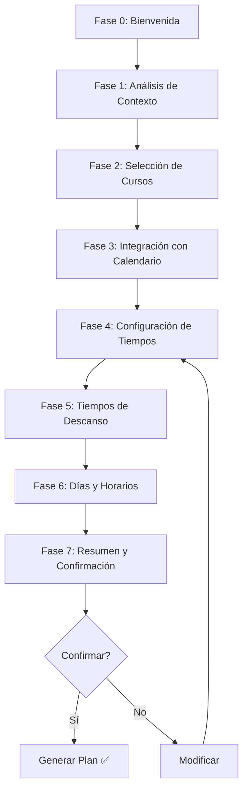

# 📚 Study Planner - Planificador de Estudios con IA

> Sistema de planificación de estudios personalizado impulsado por IA (LIA) que integra calendarios externos y aplica mejores prácticas de aprendizaje basadas en evidencia científica.

[](https://www.typescriptlang.org/)
[](https://reactjs.org/)
[](https://nextjs.org/)
[](https://gemini.google.com/)

---

## 🎯 ¿Qué es el Study Planner?

El Study Planner es un asistente conversacional inteligente que ayuda a los usuarios a crear planes de estudio personalizados basados en:

- 🧠 **Perfil profesional** (rol, empresa, disponibilidad)
- 📅 **Calendario personal** (Google Calendar, Microsoft Outlook)
- 🎓 **Cursos asignados/adquiridos**
- ⏰ **Disponibilidad real** analizada por IA
- 🎯 **Plazos y objetivos** (especialmente para usuarios B2B)

**Resultado:** Un plan de estudios optimizado con sesiones programadas automáticamente en tu calendario.

---

## ✨ Características Principales

### 🤖 Guiado por LIA (IA Conversacional)

- **Flujo de 7 fases** conversacionales
- **Análisis inteligente** de perfil y disponibilidad
- **Sugerencias personalizadas** basadas en contexto

### 📊 3 Modos de Estudio

| Modo | Velocidad | Sesiones | Ideal para |
|------|-----------|----------|------------|
| **Terminar rápido** | RÁPIDO | 60-90 min | Plazos cercanos, alta intensidad |
| **Equilibrado** | NORMAL | 45-60 min | Mayoría de usuarios, balance |
| **Sin prisa** | LENTO | 20-35 min | Ejecutivos ocupados, largo plazo |

### 🔄 Integración con Calendario

- ✅ **Google Calendar**
- ✅ **Microsoft Outlook**
- 🔍 Análisis automático de disponibilidad
- 📅 Creación automática de eventos de estudio
- ⚠️ Detección de conflictos

### 🧪 Mejores Prácticas de Aprendizaje

- 📖 **Repetición Espaciada** (Spaced Repetition)
- 🎯 **Active Recall** (Recuperación Activa)
- ⏲️ **Técnica Pomodoro** (sesiones + descansos)
- 🔀 **Estudio Intercalado** (Interleaving)
- 📈 **Práctica Distribuida** (evita cramming)

### 🏢 Soporte B2B y B2C

- **B2B**: Cursos asignados por organización, plazos fijos
- **B2C**: Selección libre de cursos, flexibilidad total

---

## 🚀 Quick Start

### 1. Importar el componente

```typescript
import { StudyPlannerLIA } from '@/features/study-planner';

function MyPage() {
  return <StudyPlannerLIA />;
}
```

### 2. Usar el hook (para integración custom)

```typescript
import { useStudyPlannerLIA } from '@/features/study-planner';

function MyCustomPlanner() {
  const {
    phase,
    messages,
    sendMessage,
    isLoading,
    phaseData,
  } = useStudyPlannerLIA();

  // Tu UI personalizada
}
```

### 3. Usar servicios individuales

```typescript
import {
  UserContextService,
  CourseAnalysisService,
  CalendarIntegrationService,
  ValidationService,
} from '@/features/study-planner';

// Obtener contexto del usuario
const userContext = await UserContextService.getUserContext(userId);

// Analizar cursos
const courses = await CourseAnalysisService.getCourseInfo(courseIds);

// Conectar calendario
const oauthUrl = await CalendarIntegrationService.connectCalendar(
  userId,
  'google'
);

// Validar configuración
const validation = ValidationService.validateSessionTimes(
  minTime,
  maxTime,
  minimumLessonTime
);
```

---

## 📁 Estructura del Proyecto

```
study-planner/
├── components/                    # Componentes UI
│   ├── StudyPlannerLIA.tsx       # ⭐ Componente principal
│   ├── CalendarConnection.tsx    # Conexión de calendarios
│   ├── PlanSummary.tsx           # Resumen del plan
│   └── StudyPlannerCalendar.tsx  # Vista de calendario
│
├── hooks/                         # React Hooks
│   ├── useStudyPlannerLIA.ts     # ⭐ Hook principal del flujo
│   └── useStudyPlannerDashboardLIA.ts
│
├── services/                      # Lógica de negocio
│   ├── user-context.service.ts           # Contexto del usuario
│   ├── calendar-integration.service.ts   # Integración calendarios
│   ├── lia-context.service.ts            # Contexto para LIA
│   ├── validation.service.ts             # Validaciones
│   ├── course-analysis.service.ts        # Análisis de cursos
│   ├── plan-generator.service.ts         # Generación de planes
│   ├── session-generator.service.ts      # Generación de sesiones
│   ├── availability-calculator.service.ts
│   ├── lesson-time.service.ts
│   └── ... (17 servicios en total)
│
├── context/                       # React Context
│   └── StudyPlannerContext.tsx
│
├── types/                         # TypeScript types
│   └── user-context.types.ts
│
├── utils/                         # Utilidades
├── prompts/                       # Prompts de LIA
├── migrations/                    # Migraciones de datos
│
├── LIA_LOGIC_FLOW.md             # 📖 Documentación de lógica
├── README.md                      # 📖 Este archivo
└── index.ts                       # Barrel exports
```

---

## 🔄 Flujo Conversacional (7 Fases)



### Descripción de Fases

| Fase | Objetivo | Datos Recopilados |
|------|----------|-------------------|
| **0. Bienvenida** | Introducción | - |
| **1. Análisis de Contexto** | Analizar perfil profesional | Rol, empresa, disponibilidad estimada |
| **2. Selección de Cursos** | Elegir cursos del plan | Lista de cursos (B2B: asignados, B2C: elegidos) |
| **3. Integración con Calendario** | Conectar calendario externo | Eventos, disponibilidad real |
| **4. Configuración de Tiempos** | Definir duración de sesiones | Min/max minutos por sesión |
| **5. Tiempos de Descanso** | Calcular descansos óptimos | Minutos de descanso |
| **6. Días y Horarios** | Configurar cuándo estudiar | Días preferidos, bloques horarios |
| **7. Resumen y Confirmación** | Revisar y confirmar | Plan completo generado |

---

## 🛠️ Tecnologías Utilizadas

### Frontend
- **React 18.3** + **TypeScript 5.9**
- **Next.js 14.2** (App Router)
- **Zustand 5.0** (State Management)
- **TailwindCSS 3.4** (Styling)
- **Framer Motion 12.2** (Animations)

### Backend / APIs
- **Google Gemini** (LIA Conversational AI)
- **Google Calendar API v3**
- **Microsoft Graph API**
- **Supabase** (PostgreSQL)

### Servicios
- **17 servicios especializados** para lógica de negocio
- **Algoritmo Greedy V2** para distribución de lecciones
- **Validaciones multicapa** (críticas + advertencias)

---

## 🎨 Modos de Distribución de Lecciones

### Algoritmo Greedy con Capacidad Estricta

El planificador utiliza un algoritmo voraz (greedy) para asignar lecciones a los slots de calendario disponibles:

```typescript
// Parámetros según modo
switch (studyApproach) {
  case 'corto':  // Terminar rápido
    maxSessionMinutes = 90;
    maxGroupsPerSlot = 999;  // Sin límite
    skipSlots = 0;
    break;

  case 'balance':  // Equilibrado
    maxSessionMinutes = 60;
    maxGroupsPerSlot = 3;
    skipSlots = 0;
    break;

  case 'largo':  // Sin prisa
    maxSessionMinutes = 35;
    maxGroupsPerSlot = 2;
    skipSlots = calculado;  // Distribuir en más días
    break;
}
```

### Comunicación con LIA

El algoritmo genera un `calendarMessage` con horarios EXACTOS:

```
📅 Lunes 17/02
  • ⏰ HORARIO EXACTO: 09:00 - 09:45 (45 min) - [IA Generativa] Intro a ChatGPT
  • ⏰ HORARIO EXACTO: 09:55 - 10:40 (45 min) - [IA Generativa] Prompting Básico

📅 Miércoles 19/02
  • ⏰ HORARIO EXACTO: 14:00 - 14:30 (30 min) - [Marketing] Fundamentos
```

**⚠️ CRÍTICO:** LIA debe copiar LITERALMENTE estos horarios, no puede redondear.

---

## 📊 API Endpoints

### Chat con LIA

```typescript
POST /api/study-planner-chat
{
  "message": string,
  "phase": StudyPlannerPhase,
  "context": StudyPlannerLIAContext
}
```

### Generar Plan

```typescript
POST /api/study-planner/generate-plan
{
  "userId": string,
  "config": StudyPlanConfig,
  "lessonDistribution": Record<string, LessonInfo[]>
}
```

### Guardar Plan

```typescript
POST /api/study-planner/save-plan
{
  "userId": string,
  "plan": StudyPlan,
  "sessions": StudySession[],
  "syncToCalendar": boolean
}
```

### Conectar Calendario

```typescript
POST /api/calendar/connect
{
  "userId": string,
  "provider": "google" | "microsoft"
}
```

---

## 🔐 Tipos Principales

### UserContext

```typescript
interface UserContext {
  user: UserBasicInfo;
  userType: 'b2b' | 'b2c';
  professionalProfile: UserProfessionalProfile;
  organization?: OrganizationInfo;
  courses: CourseInfo[];
  preferences?: StudyPreferences;
  calendarIntegration?: CalendarIntegration;
}
```

### StudyPlanConfig

```typescript
interface StudyPlanConfig {
  userId: string;
  name: string;
  selectedCourseIds: string[];
  minSessionMinutes: number;
  maxSessionMinutes: number;
  breakDurationMinutes: number;
  preferredDays: number[];  // 0-6 (Dom-Sáb)
  preferredTimeBlocks: TimeBlock[];
  targetDate?: Date;  // Para B2B
  studyApproach: 'corto' | 'balance' | 'largo';
}
```

### StudySession

```typescript
interface StudySession {
  id: string;
  planId: string;
  userId: string;
  title: string;
  courseId: string;
  lessonIds: string[];
  startTime: Date;
  endTime: Date;
  durationMinutes: number;
  status: 'planned' | 'in_progress' | 'completed' | 'cancelled' | 'skipped';
}
```

---

## ✅ Validaciones

### Validaciones Críticas (Bloquean el flujo)

| Regla | Descripción | Fase |
|-------|-------------|------|
| `MIN_SESSION` | Tiempo mínimo >= duración lección más corta | 4 |
| `CALENDAR_REQUIRED` | Calendario debe estar conectado | 3 |
| `B2B_DEADLINES` | Tiempos deben permitir cumplir plazos | 4, 6, 7 |
| `NO_CALENDAR_CONFLICTS` | Sin solapamiento con eventos | 6, 7 |
| `VALID_TIME_BLOCKS` | Bloques >= tiempo mínimo | 6 |

### Validaciones de Advertencia (No bloquean)

| Regla | Descripción |
|-------|-------------|
| `SESSION_TOO_LONG` | Sesiones > 120 min afectan concentración |
| `NO_BREAKS` | Descansos de 0 min no son recomendables |
| `FEW_DAYS` | < 3 días/semana dificulta retención |
| `TIGHT_MARGIN` | Poco margen para completar antes del plazo |

---

## 🗄️ Base de Datos

### Tablas Principales

- `study_plans` - Planes de estudio creados
- `study_sessions` - Sesiones individuales programadas
- `study_preferences` - Preferencias del usuario
- `calendar_integrations` - Conexiones de calendario
- `organization_course_assignments` - Asignaciones B2B
- `course_purchases` - Compras B2C

**Ver esquema completo:** [Database Schema](../../../../supabase/migrations/)

---

## 📚 Documentación Adicional

| Documento | Descripción |
|-----------|-------------|
| [STUDY-PLANNER.md](../../../../../STUDY-PLANNER.md) | 📖 Documentación completa (estilo CLAUDE.md) |
| [LIA_LOGIC_FLOW.md](./LIA_LOGIC_FLOW.md) | 🧠 Lógica interna de LIA y algoritmo Greedy |
| [PRD-PLANIFICADOR-ESTUDIO-IA.md](../../../../../docs/PRD-PLANIFICADOR-ESTUDIO-IA.md) | 📋 Product Requirements Document |
| [STUDY-PLANNER-FLOW.md](../../../../../docs/STUDY-PLANNER-FLOW.md) | 🔄 Flujo conversacional detallado |

---

## 🧪 Testing

### Testing Local

```bash
# Iniciar servidor de desarrollo
npm run dev:web

# Visitar el planificador
http://localhost:3000/study-planner
```

### Testing de Servicios

```typescript
import { UserContextService } from '@/features/study-planner';

// Test: Obtener contexto de usuario
const context = await UserContextService.getUserContext('user-id-123');
console.log('User Context:', context);

// Test: Validar tiempos de sesión
const validation = ValidationService.validateSessionTimes(30, 90, 25);
console.log('Validation:', validation);
```

### Mock de Calendario

Para testing sin conectar calendario real:

```typescript
const mockCalendarEvents: CalendarEvent[] = [
  {
    id: '1',
    title: 'Reunión de equipo',
    start: new Date('2026-02-17T09:00:00'),
    end: new Date('2026-02-17T10:00:00'),
    isAllDay: false,
    calendarId: 'primary',
  },
];
```

---

## 🐛 Debugging

### Debugging del Algoritmo de Distribución

```typescript
// En StudyPlannerLIA.tsx
console.warn('🔍 Distribution Debug:', {
  studyApproach,
  maxGroupsPerSlot,
  skipSlots,
  capacityRatio,
  lessonDistribution,
  slotsUntilTarget: slotsUntilTarget.length,
  validPendingLessons: validPendingLessons.length,
});
```

### Debugging de LIA Context

```typescript
// En lia-context.service.ts
console.log('📝 LIA Context for Phase:', {
  phase,
  userProfile: context.professionalProfile,
  courses: context.courses.map(c => c.title),
  calendarConnected: !!context.calendarIntegration,
});
```

---

## 🤝 Contribución

### Agregar una Nueva Fase

1. Agregar al enum `StudyPlannerPhase`
2. Crear handler `handleNewPhase()`
3. Actualizar `LiaContextService` con instrucciones
4. Agregar validaciones si es necesario

### Agregar un Nuevo Servicio

1. Crear archivo en `services/new-feature.service.ts`
2. Exportar en `services/index.ts`
3. Exportar en `index.ts` principal
4. Documentar en este README

### Agregar Nuevo Provider de Calendario

1. Actualizar tipo `CalendarProvider`
2. Implementar OAuth en `CalendarIntegrationService`
3. Implementar métodos de calendario (getEvents, createEvent)
4. Agregar UI en `CalendarConnection.tsx`

---

## 📜 Licencia

Este proyecto es parte de **SofLIA Learning Platform** y está sujeto a sus términos de licencia.

---

## 👥 Equipo

Desarrollado por el equipo de **SofLIA** con ❤️

**Contacto:** [fernando.suarez@soflia.com](mailto:fernando.suarez@soflia.com)

---

## 🔗 Enlaces Útiles

- [Documentación Principal](../../../../../README.md)
- [CLAUDE.md](../../../../../CLAUDE.md) - Guía del proyecto completo
- [STUDY-PLANNER.md](../../../../../STUDY-PLANNER.md) - Doc completa del planificador
- [API Documentation](../../../../../docs/)

---

**Última actualización:** 16/02/2026 | **Versión:** 2.0 (Greedy Algorithm V2)
