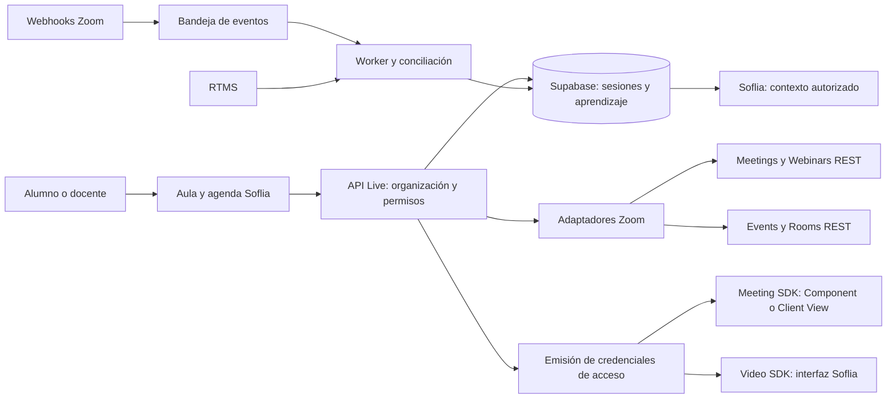

# Zoom en Soflia: investigación y plan de implementación

Estado: antecedente histórico. La decisión posterior de ejecutar las sesiones en Soflia Hub de escritorio reemplaza el alcance del aula y SDK en Learning. El contrato e implementación vigentes están en [Sesiones de Learning en Hub](learning-hub-synchronous-plan.md) y en los planes Word Learning Hub v2. La investigación de productos Zoom se conserva como referencia. La bandera de activación registrada en esta revisión histórica se retiró: el módulo vigente está disponible permanentemente.

Fecha de revisión: 10 de octubre de 2026. Commit solicitado: `7ec2c3135cdf9ff1a1ec438c5cd2b0201856e14e`. Checkout contrastado: `36b4b35c955b9099ea6ac8bcc28c01ae5fe6241e`.

## 1. Decisión recomendada

Conservar la implementación de **Meeting SDK** para reuniones y webinars, completar sus controles y operación, y agregar **Video SDK como un proveedor separado** si la experiencia propia de Soflia es un requisito. Implementar **Webinars Plus/Events como gestión de eventos** y **Zoom Rooms como integración de aulas físicas**. El módulo académico existente puede servir a los distintos proveedores.

Esta propuesta permite aprovechar el commit y cubrir el objetivo del [chat compartido de Gemini](https://gemini.google.com/share/3caffc9a5829), cuyo contenido se pudo leer en el navegador. El chat plantea una interfaz propia para las clases, pero el commit utiliza `@zoom/meetingsdk/embedded`, no `@zoom/videosdk`.

La incompatibilidad es determinante: Video SDK no puede entrar a Zoom Meetings ni Webinars. Cambiar solamente el paquete y conservar los IDs, firmas y endpoints actuales no funciona. [Autorización oficial de Video SDK](https://developers.zoom.us/docs/video-sdk/auth/).

Para la primera entrega operativa recomiendo Meetings con pantalla compartida en escritorio. Si la interfaz totalmente propia es condición de lanzamiento, desarrollar primero una prueba de Video SDK y hacer de ese proveedor el aula principal; Meetings seguirá siendo necesario para interoperar con reuniones Zoom y webinars.

## 2. Qué significa cada producto

| Necesidad | Producto | Papel dentro de Soflia |
| --- | --- | --- |
| Clase con conversación de alumnos y docente | Meetings + Meeting SDK | Reunión Zoom integrada en la plataforma |
| Aula con controles y distribución diseñados por Soflia | Video SDK | Sesión de video propia; requiere construir la experiencia multimedia |
| Equipos de trabajo dentro de la clase | Breakout rooms de Meetings, o subsessions de Video SDK | Subgrupos del proveedor seleccionado |
| Aula equipada con cámaras, micrófonos y controlador | Zoom Rooms | Recurso físico que participa en una reunión |
| Conferencia con anfitrión, panelistas y audiencia | Zoom Webinars | Formato de difusión con permisos distintos de una reunión |
| Congreso, agenda, hub, sesiones, registro y entradas | Webinars Plus / Events | Gestión adicional del evento y su acceso |

Zoom Rooms administra configuración y controles de equipos de salas; no equivale a crear un aula web. [Rooms API](https://developers.zoom.us/docs/api/rooms/). Meetings y Webinars se integran mediante Meeting SDK; las sesiones de Video SDK pertenecen a otro sistema. [Meeting SDK web](https://developers.zoom.us/docs/meeting-sdk/web/), [Video SDK](https://developers.zoom.us/docs/video-sdk/).

## 3. Correcciones necesarias al planteamiento de Gemini

1. **La API REST no reemplaza al SDK multimedia.** En el diseño propuesto, REST administra recursos y el SDK transporta/renderiza audio, video y pantalla. Una transmisión hacia Twitch es un flujo de difusión, distinto de una clase con participación bidireccional. No hay integración de Twitch en el commit.
2. **Interfaz propia implica otro proveedor.** Video SDK permite construir la UI de Soflia. Component View ofrece personalización de componentes, pero conserva la experiencia de Meetings. [Video SDK web](https://developers.zoom.us/docs/video-sdk/web/), [posicionamiento de Component View](https://developers.zoom.us/docs/meeting-sdk/web/component-view/positioning/).
3. **El JWT de Video SDK no usa los mismos campos que Meeting SDK.** Actualmente requiere `app_key`, `tpc`, `role_type`, `version`, `iat` y `exp`. No copiar el campo `role` del ejemplo conversacional. El nombre mostrado se pasa a `join`; la identidad debe correlacionarse con datos confiables del servidor. [JWT de Video SDK](https://developers.zoom.us/docs/video-sdk/auth/).
4. **La programación académica permanece en nuestra base.** Video SDK crea sesiones bajo demanda al conectarse usuarios. La agenda, el cierre académico y los permisos deben persistir en Soflia. No se crean estas sesiones con `/users/{id}/meetings`. [Video SDK: sesiones](https://developers.zoom.us/docs/video-sdk/).
5. **Entrar a una página no acredita asistencia multimedia.** El commit registra señales del navegador, no intervalos certificados por Zoom. La participación real necesita eventos del proveedor y conciliación.
6. **Ocultar botones no aplica permisos.** El servidor debe derivar el rol y el proveedor debe ejecutar las restricciones de anfitrión, micrófono y pantalla. No dar rol elevado según un valor enviado por el cliente.
7. **El acceso a datos crudos depende de la plataforma.** No interpretar el chat como garantía de audio/video crudo disponible en JavaScript web. Zoom distingue el acceso nativo a raw data y ofrece RTMS para ingesta de medios. [Video SDK: acceso a raw data](https://developers.zoom.us/docs/video-sdk/), [RTMS](https://developers.zoom.us/docs/rtms/).
8. **Video SDK tiene consumo por participantes y tiempo.** Una clase de 60 minutos con 30 alumnos y un docente suma aproximadamente 1,860 minutos de participante; agregar grabación, RTMS u otros servicios cambia el consumo. Debe cotizarse el plan vigente, sin asumir un precio fijo por clase. [Definición de minutos en Build Platform](https://developers.zoom.us/docs/build/dashboard/).

## 4. Qué ya tenemos

La funcionalidad del dominio Live, sus rutas Zoom y la migración siguen iguales entre el commit solicitado y HEAD. HEAD agrega posteriormente un ajuste de Webpack y una comprobación de compilación del SDK. El commit contiene 82 archivos y también cambios ajenos a Zoom; esta revisión se concentra en Live y su infraestructura.

| Capacidad | Estado observado | Evidencia en el repositorio |
| --- | --- | --- |
| Catálogo, agenda y espacio docente | Implementado | `LiveCatalog.tsx`, `InstructorWorkspace.tsx`, rutas `/{orgSlug}/live` y `/{orgSlug}/instructor` |
| Programación de reuniones | Implementado para reunión programada `type: 2` | `services/schedule.service.ts:66` |
| Autenticación REST | Server-to-Server OAuth, una cuenta global | `zoom.server.ts:11` |
| Entrada dentro del aula | Meeting SDK Component View, importación cliente | `ZoomStage.tsx:61` |
| Instructor como anfitrión | Firma `role: 1` y ZAK; alumnos reciben `role: 0` | `services/join.service.ts:12` y `:31` |
| Permisos académicos | Membresía activa, organización, autoría y curso asignado | `server.ts:14` y `:60` |
| Vinculación docente | Admin/owner asigna miembro y texto de ID/email Zoom | `services/instructors.service.ts:12` |
| Fin/cancelación | Finaliza reunión o la elimina en Zoom | `services/lifecycle.service.ts:25` |
| Webhook | HMAC, ventana temporal, cuenta y cambios condicionales | `zoom-webhook.ts`, `/api/internal/jobs/zoom-live` |
| Idempotencia de creación | Reserva UUID y finalización transaccional; compensación | `schedule.service.ts`, RPC `live_finalize_session` |
| Chat, quizzes, lecturas y materiales | Implementado como dominio Soflia | Componentes y `services/` de Live |
| Realtime | Sesiones, mensajes y actividades; recuperación periódica | `useLiveRoom.ts` y publicación SQL |
| Soflia pública/privada | Contexto acotado de mensajes y transcripciones | `soflia.server.ts` |
| Transcripción | Captura de subtítulos finalizados desde navegador del anfitrión | `ZoomStage.tsx:77` y `transcript.service.ts` |
| Asistencia | Señal del navegador cada 60 segundos mientras figura conectado | `ZoomStage.tsx:45`, `attendance.service.ts` |
| Secretos y materiales | Tabla de credenciales sin lectura directa del alumno; bucket privado | Migración `20261005162654_live_learning.sql` |
| Control de activación | Bandera `NEXT_PUBLIC_LIVE_LEARNING_ENABLED` | `config.ts`; habilitación exige valor `true` |

Los archivos de esta tabla están bajo `apps/web/src/features/live`, salvo las rutas, la migración y configuraciones indicadas. Existen además un tipo `ZoomSession` en `packages/shared` y variables antiguas `ZOOM_API_KEY/SECRET` en `apps/api`; no constituyen otro adaptador funcional y conviene unificarlos con los contratos actuales.

### Compartir pantalla: estado preciso

El SDK integrado ya ofrece controles de compartir pantalla. El código anuncia esa capacidad y delega la interacción a Zoom. No hay todavía una barra multimedia propia de Soflia, una política académica configurable de presentación ni validación real de pantalla/audio entre navegadores. No hace falta inventar un endpoint REST para capturar la pantalla del docente. [Funciones soportadas de Component View](https://developers.zoom.us/docs/meeting-sdk/web/component-view/supported/).

## 5. Hallazgos prioritarios de revisión

### P1: la política global bloquea la cámara

`apps/web/next-config/security-headers.js:35` establece `camera=()`. `headers.js:21` aplica esas cabeceras a `/:path*`. El commit incorporó el aula sin una excepción; HEAD conserva la misma configuración. La evaluación local de `headers()` confirma la política efectiva configurada para todas las rutas.

En navegadores que aplican Permissions Policy, el documento no puede obtener video aunque la persona acepte el permiso. La API rechaza el acceso con `NotAllowedError`. [Referencia de la directiva camera](https://developer.mozilla.org/en-US/docs/Web/HTTP/Reference/Headers/Permissions-Policy/camera).

**Corrección propuesta:** generar para la ruta del aula una política con `camera=(self), microphone=(self), display-capture=(self)`, verificar la precedencia de las reglas Next y comprobar la cabecera HTTP final en staging. Conservar la política restrictiva de otras rutas. Validar expresamente popups OAuth, COOP/COEP y recursos del SDK.

### P1 condicionado a cuenta Zoom compartida: vínculo de anfitrión sin titularidad

`instructors.service.ts:53` persiste el `zoom_user_id` arbitrario que envía un administrador de organización. No consulta Zoom ni verifica que esa organización tenga autorizado ese anfitrión. `schedule.service.ts:21` usa ese valor bajo credenciales globales y `join.service.ts:34` obtiene después su ZAK.

Si varias organizaciones comparten la cuenta Zoom global y los scopes permiten operar sobre sus usuarios, un administrador de una organización podría elegir un anfitrión destinado a otra, programar reuniones a su nombre y obtener su ZAK. La autorización académica local no impide esa selección. Es un hallazgo estático; no se probó explotación contra una cuenta real.

**Corrección propuesta:** catálogo de anfitriones aprobados por conexión/organización; resolución del ID canónico mediante Zoom; validación de cuenta, estado y titularidad antes de vincular, programar y emitir ZAK. Para una cuenta central compartida, solo un administrador de plataforma debe repartir anfitriones a organizaciones. Comprobar que la respuesta de creación tiene el anfitrión esperado.

### P2: autenticación y errores REST insuficientes para operación

`zoom.server.ts:19` solicita un access token nuevo por cada petición. `:46` convierte cualquier respuesta no exitosa en 502 sin distinguir 401, 403, 404 o 429 ni guardar el código útil de Zoom. Esto dificulta diagnóstico, control de consumo y reintentos correctos.

**Corrección propuesta:** cache de token por conexión con expiración y margen; renovación sincronizada; errores tipados; respeto de `Retry-After`; reintento acotado para lecturas y operaciones demostrablemente seguras. Conservar el tratamiento de resultado incierto en creaciones. [Autenticación y límites de API](https://developers.zoom.us/docs/api/).

### P2: webhooks sin bandeja duradera ni conciliación automática

La ruta actual escribe directamente en la base antes de responder. Las transiciones condicionales son una buena protección, pero no hay historial de entregas, UUID de instancia, cola, alertas por retraso ni recuperación de eventos perdidos.

**Corrección propuesta:** verificar y persistir el evento con una clave de deduplicación antes de confirmar; procesar con worker; conciliar estados con Zoom. Zoom pide respuesta en tres segundos y no reintenta indefinidamente. [Webhooks](https://developers.zoom.us/docs/api/webhooks/).

### P2: asistencia y transcripción dependen del navegador

La asistencia puede declararse sin prueba de presencia en la reunión. El subtitulado se ingiere solo mientras el anfitrión usa ese navegador y tiene habilitados los subtítulos. No existe una integración de grabaciones ni un consumidor RTMS. Son límites explícitos de la implementación actual, relevantes para certificados y contexto de IA.

**Corrección propuesta:** registrar intervalos del proveedor, identidad verificable y conciliación posterior; añadir RTMS para transcripción duradera cuando ese nivel de servicio sea requerido.

### Brecha de compatibilidad: Component View no cubre todo Events

La documentación actual permite Meetings, Webinars y pantalla compartida en Component View, pero marca sin soporte `Start broadcast`, simulive y PSL de Zoom Events. Tampoco soporta móvil/tablet. La matriz debe comprobarse además con la versión fijada del proyecto, 6.5.0. [Matriz oficial de funciones](https://developers.zoom.us/docs/meeting-sdk/web/component-view/supported/), [compatibilidad de navegador](https://developers.zoom.us/docs/meeting-sdk/web/browser-support/).

**Consecuencia:** no prometer toda la operación de Webinars Plus/Events dentro de `ZoomStage`. Preparar un Client View separado o acceso al cliente/portal Zoom según capacidad y rol.

## 6. Arquitectura objetivo propuesta

Mantener Live como dominio académico y separar sus proveedores. Las siguientes rutas y tablas son propuestas; todavía no existen.



Definir un contrato de proveedor con capacidades y operaciones: `schedule`, `updateSchedule`, `cancel`, `end`, `getJoinCredentials`, `reconcile` y `capabilities`. Para Video SDK, `schedule` reserva agenda y nombre de sesión propios; para Events, el acceso puede devolver un enlace individual en lugar de credenciales embebidas. No exigir las mismas operaciones a Rooms: una sala física es un recurso asociado a una sesión.

Seleccionar la experiencia por proveedor, rol y dispositivo; el backend entrega ese resultado. Separar `meeting-component`, `meeting-client`, `video-custom` y `external-link` como modos de entrada. Cargar solo el SDK requerido en cada aula.

### Modelo de datos incremental

| Cambio propuesto | Datos principales y propósito |
| --- | --- |
| `zoom_connections` | Organización, cuenta Zoom, tipo de autorización, scopes, estado y referencia segura a tokens/secretos |
| `zoom_host_bindings` | Usuario Soflia, organización, conexión, ID Zoom canónico, aprobación y capacidades verificadas |
| Ampliación `live_sessions` | `provider`, `session_kind`, `timezone`, `connection_id`, `event_id` opcional; mantener estado académico |
| `live_provider_resources` | ID del recurso remoto, tipo, conexión, host, sincronización; evitar ID global ambiguo |
| `live_session_instances` | UUID de instancia, occurrence ID si existe, inicio/fin real; distingue recurrencias y reconexiones |
| `live_registrations` | Usuario, sesión/evento, registrant ID, ticket ID, estado y referencia privada al acceso individual |
| `live_participant_intervals` | Instancia, identidad del proveedor, identidad local verificada, entradas y salidas |
| `zoom_webhook_inbox` | Cuenta, evento, clave de deduplicación, tiempos, estado de procesamiento, error y retención |
| `live_recordings` | ID de archivo, estado de procesamiento, almacenamiento y autorización |
| `live_events` / `live_event_sessions` | Hub, evento remoto, publicación y vínculo de cada sesión con su curso |
| `zoom_rooms` / `live_room_reservations` | Inventario físico, conexión, ubicación, calendario y reserva sin solapamientos |
| `live_breakout_groups` | Grupos académicos, miembros y correlación con el proveedor |

Conservar chats, actividades, respuestas y acceso privado existentes. Migrar registros actuales a `provider=zoom_meeting` y `session_kind=meeting`; mantener compatibilidad durante la transición. La restricción actual `zoom_meeting_id unique` requiere revisión antes de representar varias clases/ocurrencias de una reunión recurrente.

Separar metadatos públicos de contraseñas, ZAK, OBF, `tk`, URLs individuales y refresh tokens. Ampliar RLS con pruebas entre organizaciones; los secretos no deben incorporarse a las tablas publicadas por Realtime. Regenerar tipos Supabase tras la migración.

## 7. Meetings: completar el camino existente

### Flujo propuesto

1. El docente elige curso, fecha, zona horaria, duración, política de acceso y permisos de presentación.
2. El backend verifica autoría, conexión, anfitrión aprobado, capacidad y disponibilidad. Reservar el anfitrión para el intervalo evita concurrencia accidental; la capacidad final depende de la licencia.
3. Mantener la clave `request_id` y la reserva transaccional existentes. Agregar trazabilidad y conciliación de solicitudes inciertas; un timeout no demuestra que Zoom no creó el recurso.
4. Crear reunión programada, almacenar el recurso remoto y confirmar el resultado local. Convertir tiempos correctamente y conservar la zona del organizador para edición y visualización.
5. Para entrar, validar membresía, curso y estado en cada solicitud; derivar rol en servidor. Entregar JWT a participantes y ZAK únicamente al anfitrión autorizado.
6. Actualizar inicio/fin mediante eventos verificados; manejar inicio desde cliente Zoom, cierre externo y entregas fuera de orden.
7. Agregar reprogramación y cancelación con operación registrada, conciliación y comunicación del horario actualizado dentro de la plataforma.

Operaciones REST: `POST /users/{userId}/meetings`, `GET/PATCH/DELETE /meetings/{meetingId}`, `PUT /meetings/{meetingId}/status` y, para el anfitrión, `GET /users/{userId}/token?type=zak`. La API de Meetings documenta un límite de 100 solicitudes diarias por anfitrión para creación. [Meetings API](https://developers.zoom.us/docs/api/meetings/), [autorización del SDK](https://developers.zoom.us/docs/meeting-sdk/auth/).

### Cambios concretos

- `schemas.ts` e `InstructorForms.tsx`: zona horaria, controles de acceso y posterior formulario de edición.
- `schedule.service.ts`: anfitrión verificado, reserva temporal y resultados conciliables.
- Nuevo `reschedule.service.ts`: modificación remota y persistencia del horario con versión de operación.
- `join.service.ts`: identidad, capacidad, modo de entrada y contexto del proveedor.
- `lifecycle.service.ts`: tratar cambios externos y carreras como conciliación, no exigir que ambos sistemas estén idénticos en todo instante.
- `ZoomStage.tsx`: estado explícito de conexión, espera/admisión, reconexión y salida; limpieza antes de crear un cliente nuevo.

**Aceptación:** docente y dos alumnos completan creación, inicio, admisión, cámara, micrófono, pantalla, reingreso y cierre; nadie recibe capacidades de otro curso/organización. Reprogramar conserva una sola reunión y un timeout no causa duplicados.

## 8. Compartir pantalla en sesiones síncronas

### 8.1 Con el Meeting SDK actual

El flujo inicial debe usar el botón del SDK: el docente entra como anfitrión, pulsa Compartir, elige la superficie en el selector del navegador y confirma. El estudiante ve la transmisión en el componente. La capacidad ya forma parte del proveedor; falta verificar y diseñar su uso académico.

Implementar preflight con HTTPS, detección de capacidades, estado de permisos y mensajes accionables. Definir tres políticas: docente, docente más presentadores autorizados, y colaboración. Aplicarlas mediante controles de Zoom, no solo ocultando botones. Ajustar tamaño/posición para que la presentación sea legible y el chat/materiales sigan accesibles.

Chrome y Edge permiten compartir audio de pestaña/sistema; Firefox y Safari tienen restricciones de audio. Los navegadores móviles pueden recibir pantalla, pero no enviar screen share con Meeting SDK web. Separar esa limitación de la del aula actual, que además bloquea toda entrada móvil por usar Component View. [Compatibilidad oficial](https://developers.zoom.us/docs/meeting-sdk/web/browser-support/).

La política `display-capture` autoriza al documento a solicitar captura; **la persona sigue eligiendo y aprobando lo compartido**. No iniciar captura silenciosa al entrar. Al compartir la pestaña del aula pueden aparecer efectos de espejo; recomendar una ventana o pestaña de presentación.

No copiar métodos de Video SDK dentro de `ZoomStage`. Si se desea un botón externo de Soflia, comprobar primero que exista una API pública de Meeting SDK compatible con la versión fijada; si no, conservar el control embebido. No manipular DOM interno del proveedor.

### 8.2 Con Video SDK y controles propios

Crear `VideoSdkStage`, un hook de sesión y controles de media independientes de `ZoomStage`.

1. Obtener JWT y contexto desde backend; inicializar cliente y ejecutar `join`.
2. Obtener `client.getMediaStream()` y configurar restricciones según rol.
3. En el clic de Compartir, elegir `<video>` o `<canvas>` con `isStartShareScreenWithVideoElement()` y ejecutar `startShareScreen(element)`.
4. Renderizar la recepción con `active-share-change` o `peer-share-state-change`, `attachShareView` y `detachShareView`.
5. Guardar las vistas compartidas en un `video-player-container` separado de las cámaras.
6. Detener con `stopShareScreen`; manejar `passively-stop-share` para sincronizar la UI cuando la persona detiene desde el navegador.
7. Serializar cambios de presentador, evitar renders duplicados y limpiar listeners/vistas al salir.

Estas son las APIs actuales documentadas; Zoom recomienda migrar los receptores antiguos `startShareView/stopShareView`. [Screen share de Video SDK](https://developers.zoom.us/docs/video-sdk/web/share/), [guía de renderizado actual](https://developers.zoom.us/blog/screen-sharing-with-multiple-simultaneous-views-in-video-sdk-web/).

Para audio, usar detección de soporte y considerar WebRTC audio o WASM con SharedArrayBuffer. La opción `systemAudio` controla la solicitud del SDK, sin garantizar disponibilidad en cada combinación de navegador/OS. [Opciones de compartir en navegador](https://developers.zoom.us/docs/video-sdk/web/share-browser-options/).

**Aceptación de ambos caminos:** probar pestaña, ventana, pantalla completa, audio de presentación, rechazo del permiso, interrupción desde navegador, desconexión, cambio de presentador y estudiante sin privilegio. Documentar el comportamiento real de Chrome/Edge/Firefox/Safari; no exigir una capacidad ausente en un navegador.

## 9. Rooms: implementación separada de aulas físicas y subgrupos

### 9.1 Zoom Rooms para enseñanza híbrida

Agregar inventario administrativo por organización y conexión. Asociar ubicación, capacidad física, calendario y dispositivos; reservar la sala contra solapamientos. Una reserva física complementa la sesión Live.

El backend podrá listar `GET /rooms`, consultar `GET /rooms/{roomId}` y enviar controles mediante `PATCH /rooms/{id}/events`. Por ejemplo, el método `zoomroom.meeting_join` incorpora la sala a una reunión; el endpoint también contempla salida, mute y pantalla. La documentación exige salas configuradas y en línea. La reserva/check-in puede requerir Google Calendar o Microsoft Exchange. [Rooms API y controles](https://developers.zoom.us/docs/api/rooms/).

Implementar un servicio `rooms.service.ts` con lista permitida de comandos, permiso de administrador de sala, auditoría y estado confirmado. No exponer al cliente una función genérica para ejecutar cualquier comando remoto. No asumir que controlar el dispositivo físico autoriza capturar la pantalla del navegador del docente.

**Aceptación:** una sala autorizada participa en una clase híbrida; no se controla una sala de otra organización; se informa equipo offline y se evita doble reserva. Confirmar licencia Rooms e integración de calendario antes de comprometer esta entrega.

### 9.2 Breakout rooms para trabajo en equipo

Usar grupos académicos independientes del ID remoto. Habilitar la función del proveedor y presentar crear/asignar/abrir/cerrar/volver al grupo principal. Component View documenta soporte de breakout rooms y el SDK expone operaciones como `getBreakoutRoomList`, `assignUserToRoom`, `openBreakoutRooms` y `closeAllBreakoutRooms`; confirmar su contrato para 6.5.0 antes de implementar controles propios. [Matriz de funciones](https://developers.zoom.us/docs/meeting-sdk/web/component-view/supported/), [referencia EmbeddedClient](https://marketplacefront.zoom.us/sdk/meeting/web/components/modules/EmbeddedClient.html).

No depender de preasignación por email para alumnos invitados sin identidad Zoom verificada. Mantener chat/materiales de grupos con autorización específica. Si la clase usa Video SDK, implementar sus subsessions; nunca llamar Rooms API para crear esos equipos.

**Aceptación:** asignación válida, alumno que entra tarde, cambio de grupo, reapertura controlada y separación de contenido entre equipos.

## 10. Webinars

Agregar `session_kind=webinar` y validar la capacidad del anfitrión. El contrato de acceso diferencia anfitrión, panelista y asistente; un panelista no se convierte automáticamente en host por asignarle `role: 1` en una firma.

Operaciones principales: `POST /users/{userId}/webinars`; consulta/edición/cancelación sobre `/webinars/{webinarId}`; registro individual `/webinars/{webinarId}/registrants`; gestión de panelistas `/webinars/{webinarId}/panelists`. El anfitrión requiere el plan/add-on adecuado. [API de Webinars](https://developers.zoom.us/docs/api/meetings/).

Para entrar mediante SDK, añadir `userEmail`; con registro, obtener `tk` de la URL individual y enviarlo solo al usuario correspondiente. Host inicia con ZAK. Implementar registro y acceso como operaciones privadas con idempotencia. [Entrada a webinars desde Component View](https://developers.zoom.us/docs/meeting-sdk/web/component-view/meetings-webinars/).

Preparar Client View o cliente Zoom para producción/práctica e inicio de difusión cuando la función no esté disponible en Component View. Separar `practice`, `broadcasting` y fin en el estado remoto; una sala iniciada en práctica no debe marcar la sesión académica como emitida para todos. [Limitaciones de Component View](https://developers.zoom.us/docs/meeting-sdk/web/component-view/supported/).

Suscribir lifecycle de webinars y eventos de participantes que correspondan al alcance contratado. Definir Q&A de Zoom frente a chat/quiz de Soflia para que alumnos y moderadores entiendan dónde interactuar. Incluir moderación, permisos de intervención y trazabilidad de asistencia.

**Aceptación:** host inicia y emite, panelista entra con su acceso, asistente recibe y pregunta sin cámara/privilegios de host, un enlace individual no se entrega a otro alumno y el cierre remoto actualiza Live.

## 11. Webinars Plus / Events

La implementación actual carece de hubs, eventos, tickets, publicación y relación evento-sesiones. Agregar estos objetos como capa superior a Live, preservando los cursos y actividades por sesión.

### Secuencia propuesta

1. Validar licencia Webinars Plus/Events y permisos del organizador.
2. Listar hubs y permitir únicamente los aprobados para la organización.
3. Crear evento en borrador con zona horaria, calendario, acceso y tipo de experiencia.
4. Para eventos que admiten varias sesiones, crear sesiones y enlazarlas con cursos. No aplicar ese endpoint a un evento de sesión única.
5. Revisar configuración y publicar mediante la operación específica.
6. Crear preinscripciones/tickets después de publicar; registrar errores parciales y entregar acceso individual.
7. Mostrar agenda, sesiones, estado del acceso y recursos académicos en Soflia.
8. Conciliar participantes y resultados; guardar URLs individuales como credenciales privadas.

Endpoints: `GET /zoom_events/hubs`, `POST /zoom_events/events`, `GET/PATCH /zoom_events/events/{eventId}`, `POST /zoom_events/events/{eventId}/sessions` y `/tickets`. Crear sesiones no está disponible para eventos de sesión única; los tickets permiten lotes de hasta 30. [Events API](https://developers.zoom.us/docs/api/events/).

Publicar con `POST /zoom_events/events/{eventId}/event_actions` y `operation: "publish"`. La guía exige publicación antes de preinscribir y advierte que algunas opciones quedan bloqueadas. Es necesario validar el orden en la UI y backend. [Guía oficial de creación de eventos](https://developers.zoom.us/docs/events/api-guides/create-virtual-event/), [guía de autenticación y primer evento](https://developers.zoom.us/docs/events/api-guides/getting-started/).

En la primera versión, usar acceso individual al portal/cliente oficial como mecanismo operativo. Investigar un Client View separado para sesiones que admitan PSL; no suponer que un `eventId` sirve como `meetingNumber` ni que se puede incrustar el lobby completo. Component View no admite PSL según la matriz actual. [Funciones soportadas](https://developers.zoom.us/docs/meeting-sdk/web/component-view/supported/).

**Aceptación:** borrador, publicación, preinscripción, enlace individual, agenda de varias sesiones, acceso restringido, error parcial de lote y conciliación sin duplicar tickets. El tipo de evento se valida antes de publicar.

## 12. Video SDK: alcance de una interfaz propia

Esta fase reutiliza el dominio académico, pero desarrolla el cliente multimedia y autenticación propios del proveedor. No equivale a un reemplazo de dos imports.

- Instalar una versión fijada y soportada de `@zoom/videosdk`; revisar política mínima y compatibilidad. La guía actual recomienda 2.3.15 o superior si se utiliza WebRTC video. [Inicio de Video SDK web](https://developers.zoom.us/docs/video-sdk/web/get-started/).
- Crear credenciales Video SDK independientes de las credenciales Meetings REST/Meeting SDK.
- Reservar en Soflia un nombre opaco por sesión/ocurrencia; impedir acceso antes del horario/autorización definidos.
- Emitir JWT en servidor con rol derivado y nombre de sesión confiable. Cumplir el mínimo de 30 minutos de validez documentado; una autorización corta de nuestra API puede caducar antes, pero no inventar un JWT de cinco minutos que incumpla el SDK. [Autorización Video SDK](https://developers.zoom.us/docs/video-sdk/auth/).
- Diseñar preview, selección de dispositivos, mute, cámara, lista de participantes, levantamiento de mano, host/cohost, reconexión, expulsión y fin para todos.
- Usar renderizado público actual del SDK; evitar basarse solo en ejemplos antiguos con un canvas global.
- Implementar pantalla según la sección 8.2 y verificar subsessions si se requieren equipos.
- Mantener chat, quizzes y archivos en Supabase; el command channel puede sincronizar señales efímeras, sin reemplazar el historial autorizado.
- Correlacionar eventos con usuario local verificado y registrar consumo por organización.
- Tratar cierre de sesión y revocación de acceso conectado como operaciones explícitas; esconder el botón de entrada no expulsa a quien ya entró.

**Aceptación:** docente y alumnos operan toda la clase con controles Soflia, sin elevar roles mediante payloads del cliente; pantalla y reconexión funcionan; el fin queda persistido; no se intenta entrar a un Meeting/Webinar con este proveedor.

## 13. Conexiones, permisos y autorización externa

### Cuenta central de Soflia

Usar Server-to-Server OAuth para recursos de la cuenta central, con anfitriones explícitamente aprobados por organización. Esto es una evolución del adaptador actual. Cachear access tokens aproximadamente hasta su vencimiento, con margen. La API documenta vigencia de una hora. [Server-to-Server OAuth](https://developers.zoom.us/docs/internal-apps/s2s-oauth/), [API](https://developers.zoom.us/docs/api/).

### Organizaciones que aportan sus cuentas Zoom

Implementar OAuth con consentimiento, validación de `state`, callback autenticado, tokens protegidos, renovación, desconexión y revocación. Asociar cada operación a la conexión correcta y impedir selección arbitraria de cuentas. [OAuth oficial](https://developers.zoom.us/docs/integrations/oauth/).

La programación REST autorizada no resuelve por sí sola el acceso externo del Meeting SDK. La documentación vigente exige revisión de la app para reuniones fuera de la cuenta del desarrollador y atribución mediante ZAK u OBF. OBF permite entrada asociada a un usuario que ya está en la reunión; no sirve para iniciar como host. Este flujo debe probarse antes de ofrecer entrada anónima a cuentas externas. [Autorización Meeting SDK](https://developers.zoom.us/docs/meeting-sdk/auth/), [FAQ de cambios de autorización](https://developers.zoom.us/docs/meeting-sdk/obf-faq/).

### Registro mínimo de scopes a construir

Crear un manifiesto por operación y verificarlo contra la configuración real de Marketplace. No asumir que un scope de creación cubre edición, lectura y borrado.

| Familia | Ejemplos granulares documentados | Acciones adicionales que se deben inventariar |
| --- | --- | --- |
| Meetings | `meeting:write:meeting:admin`, `meeting:update:meeting:admin`, `meeting:delete:meeting:admin` | Lectura, finalizar, participante, grabación y token de usuario |
| Webinars | `webinar:write:webinar:admin`, `webinar:update:webinar:admin`, `webinar:delete:webinar:admin` | Registrantes, panelistas, Q&A y lifecycle |
| Rooms | `zoom_rooms:read:list_rooms:admin`, `zoom_rooms:update:room_control:admin` | Perfil, calendario y otras operaciones físicas |
| Events | `zoom_events:read:list_hubs:admin`, `zoom_events:write:event:admin` | Sesiones, tickets, registrantes y analítica |

Los ejemplos proceden de [Meetings/Webinars](https://developers.zoom.us/docs/api/meetings/), [Rooms](https://developers.zoom.us/docs/api/rooms/) y [Events](https://developers.zoom.us/docs/api/events/). Los scopes exactos para tokens y RTMS deben seleccionarse desde sus operaciones oficiales y verificarse en la app elegida. No se inspeccionó una cuenta Marketplace real durante esta investigación.

## 14. Webhooks, asistencia, grabaciones y Soflia

### Bandeja y worker

Mantener HMAC sobre el body original y validación de cuenta. Cambiar la validación rígida de cuenta global por resolución confiable de conexión. Persistir evento y clave de deduplicación; confirmar rápido; procesar fuera del request. No responder éxito antes de tener una entrega duradera.

Agregar UUID de instancia, marcas de tiempo y reglas de transición; reintentos del worker y bandeja de fallos. Conciliar solicitudes `uncertain`, sesiones activas sin señales y registros externos. La autenticación de la ruta debe continuar siendo firma Zoom; no exigir cookies de alumno ni confiar en parámetros de cuenta enviados por un usuario.

### Asistencia

Conservar la señal de página como indicador de presencia en el aula. Para asistencia de sesión, ingerir entradas/salidas del proveedor y conciliar participantes de reuniones pasadas cuando el plan y scopes lo permitan. Usar identificadores verificables, registro o ZAK; no enlazar usuarios únicamente por nombre visible ni asumir que siempre llega el email.

Calcular unión de intervalos por instancia/usuario para evitar doble conteo por reconexiones o dispositivos. Definir por producto qué cuenta como asistencia y mostrar origen/confianza del resultado antes de usarlo en certificados.

### Grabaciones

Añadir política explícita por sesión, estado de procesamiento y evento de finalización de grabación. Descargar de forma autorizada con un worker, conservar acceso privado y ofrecer reproducción en el curso. No exponer tokens ni convertir enlaces de host en enlaces de alumnos. Establecer retención y revocación; cloud recording depende de licencia/configuración.

### Transcripción para Soflia

Actualmente Soflia recibe hasta 60 mensajes públicos, 100 segmentos y 8 turnos privados; no analiza pantalla ni recibe todo el audio. Compartir diapositivas no incorpora automáticamente su contenido a la IA.

Para contexto continuo de Meetings/Webinars, agregar RTMS con permisos y activación correspondientes, ingesta en un proceso persistente, reconexión, deduplicación y contexto por instancia. Los eventos `meeting.rtms_started/stopped` y sus equivalentes de webinar coordinan el stream. No mantener una conexión larga dentro del handler Next del webhook. Ubicación propuesta: worker bajo `apps/api/src/features/live` o servicio separado, según despliegue. [Quickstart RTMS con WebSockets](https://developers.zoom.us/docs/rtms/meetings/quickstart-websockets/).

Zoom presenta RTMS como la vía para asistentes de IA e ingesta en tiempo real. Revisar ese requisito para el uso de subtítulos como contexto de Soflia; no ampliar el Meeting SDK a un bot de captura. RTMS requiere créditos y capacidad de streams. [Política de uso del Meeting SDK](https://developers.zoom.us/docs/meeting-sdk/web/), [RTMS](https://developers.zoom.us/docs/rtms/).

## 15. Plan de entregas y esfuerzo orientativo

Los rangos son estimaciones propias de días de ingeniería, incluyendo pruebas focalizadas; no son fechas comprometidas ni plazos de revisión de Zoom. Suponen acceso a staging y licencias disponibles. Las fases comparten infraestructura, por lo que no deben sumarse como cotización definitiva.

| Fase | Trabajo | Dependencias | Aceptación para cerrar | Esfuerzo |
| --- | --- | --- | --- | --- |
| 0 | Decisión de proveedor, cuenta central/externa, licencias y prueba multimedia mínima | Cuenta de prueba y criterios de producto | Demo de host + alumno + pantalla y ruta de webinar/evento elegida | 2–4 días |
| 1 | Cámara, vínculo seguro de anfitrión, token cache, errores y conciliación de creación | Fase 0 | Dos organizaciones aisladas, cámara usable y cero duplicados al simular timeout | 4–7 días |
| 2 | Meetings completos, reprogramación, preflight y políticas de compartir | Fase 1 | Clase completa con docente y alumnos; pruebas por navegador | 4–7 días |
| 3 | Bandeja/worker, intervalos de asistencia, grabaciones y RTMS según SLA | Fase 1; infraestructura persistente | Eventos repetidos/desordenados, transcripción independiente del browser, conciliación | 6–12 días |
| 4 | Webinars, registro, panelistas y Client View/cliente para producción | Fases 1–2; licencia | Práctica → difusión → cierre con roles correctos | 4–7 días |
| 5 | Events: hubs, agenda, publicación, tickets y acceso individual | Fases 3–4; licencia y permisos de hub | Evento publicado, varias sesiones y lotes parciales conciliados | 6–10 días |
| 6 | Breakout rooms y grupos académicos | Fase 2 o 7 | Equipos aislados con entrada tardía, reasignación y retorno | 3–5 días |
| 7 | Video SDK con interfaz propia completa | Fases 0–1; modelo de proveedores | Clase Soflia completa con permisos efectivos, pantalla y reconexión | 10–18 días |
| 8 | Rooms físicos, reservas, calendario y controles | Fases 1–2; hardware/licencia/calendario | Clase híbrida, controles autorizados y manejo offline | 4–8 días |
| 9 | OAuth multicuenta y acceso externo del Meeting SDK | Fase 1; app/revisión externa | Dos cuentas Zoom independientes y flujo de autorización admitido | 5–9 días, más revisión externa |

**Orden sugerido para aprovechar el commit:** 0 → 1 → 2 → 3 → 4 → 5. Incluir 6 para trabajo por equipos; 8 cuando haya aulas físicas; 9 cuando las organizaciones aporten cuentas. Si la interfaz propia es requisito prioritario, ejecutar 7 después de 1 y antes de ampliar Events.

### Primer backlog concreto

| ID | Cambio | Archivos/área | Prioridad |
| --- | --- | --- | --- |
| Z01 | Excepción acotada de permisos de cámara/media | `next-config/security-headers.js`, `headers.js` | P1 |
| Z02 | Host aprobado por organización y conexión | `instructors.service.ts`, `schedule.service.ts`, `join.service.ts`, SQL | P1 |
| Z03 | Token cache y errores tipados | Dividir `zoom.server.ts` en auth/http/adaptadores | P2 |
| Z04 | Modelo de proveedor/instancia y migración compatible | `types.ts`, `database.types.ts`, Supabase | P2 |
| Z05 | Preflight y estados de conexión | `ZoomStage.tsx`, `LiveRoom.tsx` | P2 |
| Z06 | Edición de agenda y reserva de anfitrión | Schemas, formularios, servicios nuevos | P2 |
| Z07 | Inbox, worker y conciliación | Webhook actual + `apps/api`/worker | P2 |
| Z08 | Presentación académica y compatibilidad | Stage, políticas y layout | P2 |
| Z09 | Registro y roles de webinar | Adaptador, join, formularios y tablas | P2 |
| Z10 | Events y entrada individual | Servicios de eventos, agenda y tickets | P2 |
| Z11 | Video SDK si UI propia es requisito | Nuevo Stage/hook/token + capacidades | Prioridad de producto |
| Z12 | Rooms/breakouts según caso de uso | Servicios y permisos independientes | Prioridad de producto |

## 16. Pruebas y salida a producción

### Pruebas automatizadas que faltan

- Vincular un host ajeno, cambiar connection ID y pedir ZAK/OBF para un usuario no autorizado.
- Crear reunión y perder la respuesta remota; perder la respuesta SQL; compensación fallida; conciliación posterior.
- Cache de OAuth, expiración, 401, 403, 429 y respuesta de Zoom malformada.
- Edición concurrente y conflictos de reserva de anfitrión/sala.
- Webhooks reales de lifecycle, repetidos y fuera de orden, con cuenta e instancia correctas.
- Unión de intervalos de asistencia y correlación de identidad; no acreditar la señal de página como asistencia Zoom.
- Registro/panelista/asistente; privacidad de `tk`, PSL y tickets.
- Ciclo de React del SDK: salir, reingresar, desmontar durante join y reconectar sin duplicar clientes/listeners.
- Video SDK: JWT y rol derivados de servidor, permisos efectivos de pantalla y cierre.
- RLS para todas las tablas nuevas, aislamiento de grupos y secretos fuera de Realtime.

### Validación manual en staging

Usar cuentas de docente y alumnos reales de prueba, dos organizaciones y, para multicuenta, dos cuentas Zoom. Probar escritorio y la alternativa móvil elegida. Verificar las cabeceras HTTP servidas, permiso denegado, invitación, espera, salida externa, pantalla con audio, acceso a webinar en práctica/difusión y un evento con varias sesiones.

Definir SLOs medibles para entrada, retraso de estado y transcripción. Ejecutar carga sobre nuestras APIs, Realtime y workers con datos sintéticos; dimensionar salas/concurrencia/licencias por separado. La prueba local de compilación no acredita capacidad de Zoom ni de 100,000 usuarios de Soflia.

Liberar por organización y capacidad después de cumplir los criterios. Registrar métricas sin contenido ni credenciales: errores por código, latencia de join/webhook, retraso de transcripción, solicitudes inciertas y consumo por organización. Rollback: retirar la capacidad o bandera y conservar datos; no eliminar automáticamente tablas o reuniones.

## 17. Verificación ejecutada durante esta revisión

Se revisaron el diff del commit, servicios, componentes, migración, middleware, cabeceras y documentación local. Se comprobó que el commit es antecesor de HEAD y que el dominio Live no cambió desde él. Se leyó el chat público de Gemini y se consultaron las fuentes oficiales enlazadas en cada apartado.

Comando ejecutado:

```text
npm.cmd test --workspace=apps/web -- src/features/live/__tests__ src/lib/security/__tests__/content-security-policy.test.ts src/lib/security/__tests__/security-headers-config.test.ts
```

Resultado: **5 archivos aprobados, 13 pruebas aprobadas; 1 suite no pudo cargarse** porque `@electric-sql/pglite` no está instalado en este checkout. El paquete sí está declarado y fijado en package/lockfile. Por ello no se afirma que la migración/RLS pasen hoy.

También se ejecutó:

```text
npm.cmd run check:zoom-sdk --workspace=apps/web
```

Resultado: **bloqueado por dependencia local ausente** `@zoom/meetingsdk/embedded`. El paquete está declarado como 6.5.0. HEAD contiene un parche de parser para el bundle UMD y un script para verificarlo, pero su compilación no pudo confirmarse aquí.

La evaluación local de la función de cabeceras confirmó `camera=()` en la regla global. No se hicieron llamadas autenticadas a Zoom, no se inspeccionaron licencias/scopes en una cuenta real, no se aplicaron migraciones remotas y no se certificó el flujo multimedia end-to-end. Esta entrega agrega investigación y planificación; las correcciones de aplicación quedan como trabajo definido en el backlog.

## 18. Decisiones para iniciar la implementación

1. ¿La UI propia de Soflia es requisito de lanzamiento o una evolución posterior? Propuesta: evolución separada de Video SDK, salvo requisito explícito de producto.
2. ¿Soflia proporciona anfitriones o cada organización aporta cuenta Zoom? Propuesta: cuenta central con anfitriones aprobados para la primera etapa; OAuth multicuenta cuando exista demanda concreta.
3. ¿Rooms significa hardware de aula o equipos de trabajo? Este plan cubre ambos, con integraciones distintas.
4. ¿La asistencia se usa para certificados? Si sí, ejecutar intervalos del proveedor y conciliación antes de emitirlos.
5. ¿Soflia requiere contexto continuo de la clase? Si sí, RTMS y worker deben formar parte de la entrega operativa.
6. ¿Events debe permanecer totalmente dentro de Soflia? Propuesta inicial: agenda y aprendizaje dentro de Soflia, acceso individual al entorno Zoom; validar Client View y PSL antes de prometer una experiencia completamente embebida.

Estas decisiones no impiden corregir desde ahora cámara, autorización de anfitriones y robustez REST. Las licencias, hardware y revisión de app son dependencias externas que deben confirmarse durante la fase 0.
