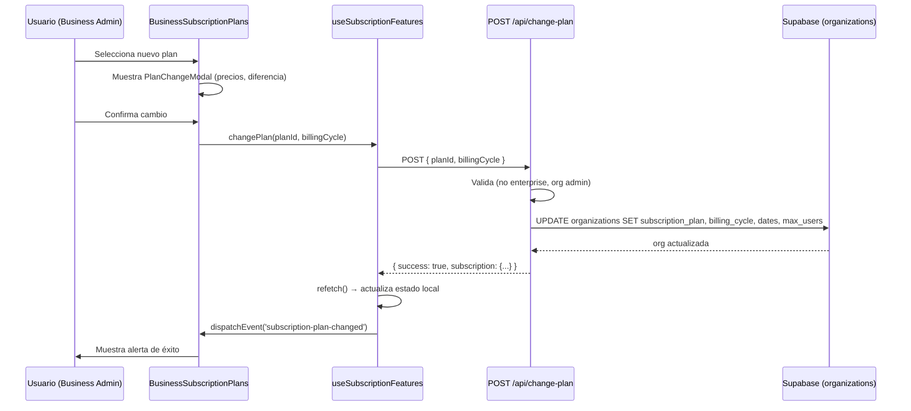

# Documentación del Sistema de Suscripciones — SofLIA Learning

> **Fuente:** Extracción del repositorio `SofLIA-Learning`
> **Fecha de extracción:** 2026-05-26
> **Contexto:** Plataforma B2B de entrenamiento en IA para empresas

---

## Tabla de Contenidos

1. [Resumen Ejecutivo](#1-resumen-ejecutivo)
2. [Modelo de Datos (Base de Datos)](#2-modelo-de-datos-base-de-datos)
3. [Planes de Suscripción](#3-planes-de-suscripción)
4. [Matriz de Características por Plan](#4-matriz-de-características-por-plan)
5. [API Endpoints](#5-api-endpoints)
6. [Capa de Servicios (Backend)](#6-capa-de-servicios-backend)
7. [Hooks del Frontend](#7-hooks-del-frontend)
8. [Componentes de UI](#8-componentes-de-ui)
9. [Validación y Esquemas Zod](#9-validación-y-esquemas-zod)
10. [Tests Unitarios](#10-tests-unitarios)
11. [Tipos TypeScript](#11-tipos-typescript)
12. [Flujo de Cambio de Plan](#12-flujo-de-cambio-de-plan)
13. [Notas de Arquitectura y Deuda Técnica](#13-notas-de-arquitectura-y-deuda-técnica)

---

## 1. Resumen Ejecutivo

El sistema de suscripciones en SofLIA-Learning opera **a nivel de organización** (B2B). Cada organización tiene un plan de suscripción que determina qué características están disponibles para todos sus usuarios. Los planes individuales de usuario existen como tabla auxiliar (`subscriptions`) pero la **fuente de verdad primaria** es la tabla `organizations`.

### Principio de Resolución de Plan

```
1. Leer organizations.subscription_plan  ← fuente primaria
2. Si no disponible → leer subscriptions.plan_id donde status = 'active'
3. Si ninguno → sin plan (acceso denegado a features restringidas)
```

---

## 2. Modelo de Datos (Base de Datos)

### 2.1 Tabla `subscriptions` (auxiliar/usuario)

**Archivo SQL:** [`supabase/scripts/Database.sql` L1679–L1694](file:///d:/Pulse%20Hub/SofLIA-Learning/supabase/scripts/Database.sql#L1679-L1694)
**Schema TypeScript:** [`lib/supabase/schema/tables/subscriptions.table.ts`](file:///d:/Pulse%20Hub/SofLIA-Learning/apps/web/src/lib/supabase/schema/tables/subscriptions.table.ts)

```sql
CREATE TABLE public.subscriptions (
  subscription_id       uuid      NOT NULL DEFAULT gen_random_uuid(),
  subscription_type     varchar   NOT NULL
    CHECK (subscription_type IN ('monthly', 'yearly', 'lifetime', 'course_access')),
  subscription_status   varchar   DEFAULT 'active'
    CHECK (subscription_status IN ('active', 'paused', 'cancelled', 'expired')),
  price_cents           integer   NOT NULL CHECK (price_cents > 0),
  start_date            timestamptz DEFAULT now(),
  end_date              timestamptz,
  next_billing_date     timestamptz,
  created_at            timestamptz DEFAULT now(),
  updated_at            timestamptz DEFAULT now(),
  user_id               uuid      NOT NULL,  -- FK → users(id)
  course_id             uuid,               -- FK → courses(id) (para course_access)
  plan_id               varchar
    CHECK (plan_id IN ('team', 'business', 'enterprise')),
  CONSTRAINT subscriptions_pkey PRIMARY KEY (subscription_id)
);
```

| Campo | Tipo | Descripción |
|---|---|---|
| `subscription_id` | uuid | PK, autogenerado |
| `subscription_type` | varchar | `monthly`, `yearly`, `lifetime`, `course_access` |
| `subscription_status` | varchar | `active`, `paused`, `cancelled`, `expired` |
| `price_cents` | integer | Precio en centavos (evita punto flotante) |
| `start_date` | timestamptz | Inicio de la suscripción |
| `end_date` | timestamptz | Fecha de expiración |
| `next_billing_date` | timestamptz | Próximo cargo |
| `user_id` | uuid | Usuario al que pertenece |
| `course_id` | uuid | Solo para tipo `course_access` |
| `plan_id` | varchar | Plan: `team`, `business`, `enterprise` |

---

### 2.2 Campos de suscripción en `organizations` (fuente primaria)

**Archivo SQL:** [`supabase/scripts/Database.sql` L1272–L1307](file:///d:/Pulse%20Hub/SofLIA-Learning/supabase/scripts/Database.sql#L1272-L1307)
**Schema TypeScript:** [`lib/supabase/schema/tables/organizations.row.ts`](file:///d:/Pulse%20Hub/SofLIA-Learning/apps/web/src/lib/supabase/schema/tables/organizations.row.ts)

```sql
-- Columnas de suscripción dentro de organizations:
subscription_plan       varchar  DEFAULT 'team'
  CHECK (subscription_plan IN ('team', 'business', 'enterprise')),
subscription_status     varchar  DEFAULT 'active'
  CHECK (subscription_status IN ('active', 'expired', 'cancelled', 'trial', 'pending')),
subscription_start_date timestamp,
subscription_end_date   timestamp,
billing_cycle           varchar
  CHECK (billing_cycle IN ('monthly', 'yearly')),
max_users               integer  DEFAULT 10,
```

| Campo | Descripción |
|---|---|
| `subscription_plan` | Plan activo: `team` / `business` / `enterprise` |
| `subscription_status` | Estado: `active`, `expired`, `cancelled`, `trial`, `pending` |
| `subscription_start_date` | Inicio del período de suscripción |
| `subscription_end_date` | Fin del período actual |
| `billing_cycle` | `monthly` o `yearly` |
| `max_users` | Límite de usuarios permitidos en la org |

> **Nota:** Los estados de `organizations.subscription_status` incluyen `trial` y `pending`, que **no existen** en `subscriptions.subscription_status`. Esta discrepancia es una deuda técnica conocida.

---

### 2.3 Tabla `notification_push_subscriptions`

**Archivo SQL:** [`supabase/scripts/Database.sql` L866–L877](file:///d:/Pulse%20Hub/SofLIA-Learning/supabase/scripts/Database.sql#L866-L877)
**Schema TypeScript:** [`lib/supabase/schema/tables/notification-push-subscriptions.table.ts`](file:///d:/Pulse%20Hub/SofLIA-Learning/apps/web/src/lib/supabase/schema/tables/notification-push-subscriptions.table.ts)

Registra los endpoints push (Web Push API) de los usuarios para notificaciones.

```sql
CREATE TABLE public.notification_push_subscriptions (
  subscription_id  uuid       NOT NULL DEFAULT gen_random_uuid(),
  user_id          uuid       NOT NULL,   -- FK → users(id)
  endpoint         text       NOT NULL,   -- URL del endpoint push
  keys             jsonb      NOT NULL,   -- {p256dh, auth} para cifrado
  status           varchar    DEFAULT NULL,
  user_agent       text,
  last_used_at     timestamptz,
  created_at       timestamptz DEFAULT now(),
  updated_at       timestamptz DEFAULT now(),
  CONSTRAINT notification_push_subscriptions_pkey PRIMARY KEY (subscription_id)
);
```

> **Acceso restringido por plan:** Solo disponible en planes `business` y `enterprise` (feature: `notification_push`).

---

### 2.4 Tabla `calendar_subscription_tokens`

**Archivo SQL:** [`supabase/scripts/Database.sql` L137–L145](file:///d:/Pulse%20Hub/SofLIA-Learning/supabase/scripts/Database.sql#L137-L145)
**Vista asociada:** [`lib/supabase/schema/views/user-calendar-subscriptions.view.ts`](file:///d:/Pulse%20Hub/SofLIA-Learning/apps/web/src/lib/supabase/schema/views/user-calendar-subscriptions.view.ts)

Tokens para suscripción al calendario del Study Planner vía iCal/URL pública.

```sql
CREATE TABLE public.calendar_subscription_tokens (
  id           uuid        NOT NULL DEFAULT gen_random_uuid(),
  user_id      uuid        NOT NULL,   -- FK → users(id)
  token        text        NOT NULL,   -- token único para la URL de iCal
  last_used_at timestamptz,
  usage_count  integer     DEFAULT 0,
  created_at   timestamptz DEFAULT now(),
  CONSTRAINT calendar_subscription_tokens_pkey PRIMARY KEY (id)
);
```

**Vista `user_calendar_subscriptions`:** Agrega información adicional como `active_sessions_count` y `has_calendar_integrations`.

---

## 3. Planes de Suscripción

**Archivo de lógica:** [`features/business-panel/hooks/useBusinessSubscriptionPlansLogic.ts`](file:///d:/Pulse%20Hub/SofLIA-Learning/apps/web/src/features/business-panel/hooks/useBusinessSubscriptionPlansLogic.ts)

### Planes disponibles

| Plan | ID | Usuarios máx. | Precio mensual | Precio anual | Notas |
|---|---|---|---|---|---|
| **Team** | `team` | 10 | $499/mes | $4,999/año | Plan base |
| **Business** | `business` | 50 | $1,499/mes | $14,999/año | Popular (badge "20% OFF") |
| **Enterprise** | `enterprise` | Ilimitado | Personalizado | Personalizado | Requiere contacto ventas |

### Ciclos de facturación

- `monthly` — facturación mensual
- `yearly` — facturación anual (descuento implícito)

### Restricción del plan Enterprise

El plan `enterprise` **no se puede cambiar desde la UI**. Al seleccionarlo, el sistema muestra un modal para contactar al equipo de ventas y retorna error `ENTERPRISE_REQUIRES_SALES` (HTTP 400) desde la API.

---

## 4. Matriz de Características por Plan

**Archivos:** [`lib/subscription/subscriptionFeatures/access.ts`](file:///d:/Pulse%20Hub/SofLIA-Learning/apps/web/src/lib/subscription/subscriptionFeatures/access.ts) · [`lib/subscription/subscription-features/feature-map.ts`](file:///d:/Pulse%20Hub/SofLIA-Learning/apps/web/src/lib/subscription/subscription-features/feature-map.ts)

### Leyenda

- ✅ Disponible
- ❌ No disponible

### Administración y Gestión

| Feature (FeatureKey) | Nombre visible | Team | Business | Enterprise |
|---|---|:---:|:---:|:---:|
| `panel_admin` | Panel de administración | ✅ | ✅ | ✅ |
| `course_messaging` | Asignación de cursos con mensajería | ❌ | ✅ | ✅ |
| `custom_groups` | Grupos de usuarios personalizados | ❌ | ✅ | ✅ |
| `advanced_groups` | Administración avanzada de grupos | ❌ | ❌ | ✅ |
| `corporate_branding` | Branding corporativo | ❌ | ❌ | ✅ |

### Análisis e Informes

| Feature (FeatureKey) | Nombre visible | Team | Business | Enterprise |
|---|---|:---:|:---:|:---:|
| `basic_reports` | Reportes básicos | ✅ | ✅ | ✅ |
| `advanced_analytics` | Analytics avanzados | ❌ | ✅ | ✅ |
| `skills_info` | Información de habilidades | ❌ | ✅ | ✅ |
| `course_analysis` | Análisis de cursos | ❌ | ✅ | ✅ |
| `custom_dashboard` | Dashboard personalizado | ❌ | ❌ | ✅ |
| `data_export` | Exportación de datos | ❌ | ❌ | ✅ |

### Experiencia del Usuario

| Feature (FeatureKey) | Nombre visible | Team | Business | Enterprise |
|---|---|:---:|:---:|:---:|
| `full_catalog` | Acceso a catálogo completo | ✅ | ✅ | ✅ |
| `unlimited_certifications` | Certificaciones ilimitadas | ❌ | ✅ | ✅ |
| `custom_certificates` | Certificados personalizados | ❌ | ❌ | ✅ |
| `mobile_app` | Aplicación móvil | ✅ | ✅ | ✅ |
| `offline_learning` | Offline learning | ❌ | ✅ | ✅ |
| `live_courses` | Cursos en vivo | ❌ | ❌ | ✅ |

### Notificaciones y Automatización

| Feature (FeatureKey) | Nombre visible | Team | Business | Enterprise |
|---|---|:---:|:---:|:---:|
| `automatic_notifications` | Notificaciones automáticas | ✅ | ✅ | ✅ |
| `notification_email` | Notificaciones por Email | ✅ | ✅ | ✅ |
| `smart_reminders` | Recordatorios inteligentes | ❌ | ✅ | ✅ |
| `notification_push` | Notificaciones Push | ❌ | ✅ | ✅ |
| `notification_sms` | Notificaciones por SMS | ❌ | ❌ | ✅ |
| `external_integrations` | Integración con sistemas externos | ❌ | ✅ | ✅ |
| `enterprise_sso` | SSO empresarial | ❌ | ✅ | ✅ |
| `calendar_integration` | Integración con calendarios | ❌ | ✅ | ✅ |
| `data_api` | API de datos | ❌ | ❌ | ✅ |

### Soporte y Servicios

| Feature (FeatureKey) | Nombre visible | Team | Business | Enterprise |
|---|---|:---:|:---:|:---:|
| `email_support` | Soporte por email | ✅ | ✅ | ✅ |
| `priority_support` | Soporte prioritario | ❌ | ✅ | ✅ |
| `dedicated_247_support` | Soporte 24/7 dedicado | ❌ | ❌ | ✅ |
| `customer_success_manager` | Customer Success Manager | ❌ | ❌ | ✅ |
| `custom_onboarding` | Onboarding personalizado | ❌ | ❌ | ✅ |
| `strategic_consulting` | Consultoría estratégica | ❌ | ❌ | ✅ |

---

## 5. API Endpoints

### 5.1 Obtener información de suscripción

```
GET /api/[orgSlug]/business/settings/subscription
```

**Archivo:** [`app/api/[orgSlug]/business/settings/subscription/route.get.ts`](file:///d:/Pulse%20Hub/SofLIA-Learning/apps/web/src/app/api/[orgSlug]/business/settings/subscription/route.get.ts)

**Autorización:** Requiere rol `Business` (admin de organización)

**Respuesta exitosa (200):**
```json
{
  "success": true,
  "subscription": {
    "plan": "business",
    "status": "active",
    "billing_cycle": "yearly",
    "start_date": "2025-01-01T00:00:00Z",
    "end_date": "2026-01-01T00:00:00Z",
    "is_expired": false,
    "days_until_expiration": 220,
    "is_expiring_soon": false,
    "max_users": 50,
    "user_subscriptions": [],
    "active_subscription": null
  }
}
```

> **Nota:** `is_expiring_soon` se activa cuando `days_until_expiration <= 30`.

---

### 5.2 Actualizar suscripción (PATCH simple)

```
PUT /api/[orgSlug]/business/settings/subscription
```

**Archivo:** [`app/api/[orgSlug]/business/settings/subscription/route.put.ts`](file:///d:/Pulse%20Hub/SofLIA-Learning/apps/web/src/app/api/[orgSlug]/business/settings/subscription/route.put.ts)

**Body:**
```json
{
  "planId": "business",        // opcional: team | business | enterprise
  "billingCycle": "yearly"     // opcional: monthly | yearly
}
```

**Lógica:** Actualiza directamente `organizations.subscription_plan` y `billing_cycle`. También ajusta `max_users` según el plan.

---

### 5.3 Cambiar plan (flujo completo)

Existen **dos rutas** para cambio de plan (duplicación detectada):

#### Ruta principal

```
POST /api/[orgSlug]/business/subscription/change-plan
```

**Archivo:** [`app/api/[orgSlug]/business/subscription/change-plan/route.ts`](file:///d:/Pulse%20Hub/SofLIA-Learning/apps/web/src/app/api/[orgSlug]/business/subscription/change-plan/route.ts)

#### Ruta alternativa (settings)

```
POST /api/[orgSlug]/business/settings/subscription/change-plan
```

**Archivo:** [`app/api/[orgSlug]/business/settings/subscription/change-plan/route.ts`](file:///d:/Pulse%20Hub/SofLIA-Learning/apps/web/src/app/api/[orgSlug]/business/settings/subscription/change-plan/route.ts)

**Body (ambas rutas):**
```json
{
  "planId": "business",       // team | business (enterprise bloqueado)
  "billingCycle": "yearly"    // monthly | yearly
}
```

**Lógica de cambio:**
1. Valida que `planId !== 'enterprise'` (requiere ventas → error 400)
2. Obtiene org actual para comparación
3. Si mismo plan + mismo ciclo → retorna `200` sin cambios
4. Calcula nuevas fechas: `start_date = now()`, `end_date = +1 mes o +1 año`
5. Actualiza `organizations` con nuevo plan, ciclo y `max_users`

**`max_users` por plan:**
```
team       → 10
business   → 50
enterprise → 999999
```

**Respuesta exitosa (200):**
```json
{
  "success": true,
  "message": "Plan actualizado exitosamente",
  "organization": { ... },
  "subscription": {
    "plan": "business",
    "billing_cycle": "yearly",
    "start_date": "2026-05-26T...",
    "end_date": "2027-05-26T...",
    "max_users": 50
  }
}
```

**Errores posibles:**
| Código error | HTTP | Descripción |
|---|---|---|
| `ENTERPRISE_REQUIRES_SALES` | 400 | Enterprise requiere contacto con ventas |
| `ORG_SLUG_REQUIRED` | 400 | Falta el slug de organización |
| `FORBIDDEN` | 403 | Solo admins pueden cambiar el plan |
| `NO_ORGANIZATION` | 403 | Sin organización asignada |
| `FETCH_ORGANIZATION_FAILED` | 500 | Error al obtener la organización |
| `UPDATE_SUBSCRIPTION_PLAN_FAILED` | 500 | Error al actualizar en BD |

---

## 6. Capa de Servicios (Backend)

### 6.1 `SubscriptionService` (server-only)

**Archivo:** [`features/business-panel/services/subscription.service.ts`](file:///d:/Pulse%20Hub/SofLIA-Learning/apps/web/src/features/business-panel/services/subscription.service.ts)

Clase estática con métodos para verificación y cálculo de suscripciones.

#### `hasActiveSubscription(userId, organizationId?)`

Verifica si una organización tiene suscripción activa válida.

**Lógica de verificación:**
1. Resuelve `organizationId` si no se provee (via `organization_users`)
2. Consulta `organizations` para verificar: `is_active = true`, plan válido, estado `active|trial`, fecha no expirada
3. Si falla → fallback a tabla `subscriptions`

> ⚠️ **Advertencia:** Sin `organizationId` explícito, usuarios multi-empresa pueden obtener la organización incorrecta.

#### `calculateBillingPeriod(subscriptionStartDate, billingCycle)`

Calcula el período de facturación actual basado en la fecha de inicio y el ciclo.

#### `getOrganizationMonthlyCourseCount(organizationId, periodStart, periodEnd)`

Cuenta cursos comprados por la organización en un período dado (tabla `organization_course_purchases`).

#### `canOrganizationPurchaseCourse(organizationId, maxCourses = 10)`

Verifica si la organización puede comprar más cursos en el período actual. Límite por defecto: **10 cursos por período**.

---

### 6.2 `fetchSubscriptionStatus` (server)

**Archivo:** [`features/business-panel/services/business-course-subscription-status.server.service.ts`](file:///d:/Pulse%20Hub/SofLIA-Learning/apps/web/src/features/business-panel/services/business-course-subscription-status.server.service.ts)

Función que agrega el estado de suscripción de un usuario para una vista de detalle de curso:

```typescript
interface BusinessCourseSubscriptionStatus {
  hasSubscription: boolean
  isOrganizationPurchased: boolean
  hasAccessToContent: boolean
  canPurchaseForFree: boolean
  monthlyCourseCount: number
  maxCoursesPerPeriod: number
}
```

---

### 6.3 `subscriptionHelper.ts` (API middleware)

**Archivo:** [`lib/subscription/subscriptionHelper.ts`](file:///d:/Pulse%20Hub/SofLIA-Learning/apps/web/src/lib/subscription/subscriptionHelper.ts)

Helpers para validar features en API routes:

#### `getOrganizationPlan(organizationId)` → `SubscriptionPlan | null`

Obtiene el plan activo de una organización. Consulta primero `organizations.subscription_plan`, luego `subscriptions.plan_id`.

#### `requireFeature(organizationId, feature)` → `NextResponse | null`

Middleware para proteger rutas por feature. Retorna `403` si el plan no incluye la feature.

**Uso en API routes:**
```typescript
const check = await requireFeature(auth.organizationId, 'advanced_analytics')
if (check) return check  // retorna 403 automáticamente
// ... lógica protegida
```

#### `checkFeature(organizationId, feature)` → `{ available, plan, message? }`

Versión booleana sin NextResponse, para validaciones internas.

---

## 7. Hooks del Frontend

### 7.1 `useSubscriptionFeatures`

**Archivo:** [`features/business-panel/hooks/useSubscriptionFeatures.ts`](file:///d:/Pulse%20Hub/SofLIA-Learning/apps/web/src/features/business-panel/hooks/useSubscriptionFeatures.ts)

Hook principal para consumir el plan de suscripción en componentes cliente.

**Retorna:**
```typescript
{
  plan: SubscriptionPlan | null          // 'team' | 'business' | 'enterprise'
  billingCycle: 'monthly' | 'yearly' | null
  subscription: SubscriptionInfo | null  // datos completos
  loading: boolean
  canUse: (feature: FeatureKey) => boolean
  getRequiredPlan: (feature: FeatureKey) => SubscriptionPlan | null
  getMessage: (feature: FeatureKey) => string
  getFeatureName: (feature: FeatureKey) => string
  getAllowedChannels: () => string[]      // canales de notificación permitidos
  changePlan: (planId, billingCycle) => Promise<{ success, error? }>
  refetch: () => Promise<void>
}
```

**Fuente de datos:** `GET /api/[orgSlug]/business/settings`

**Evento personalizado:** Al cambiar plan exitosamente dispara `subscription-plan-changed` en `window`.

---

### 7.2 `useBusinessSubscriptionPlansLogic`

**Archivo:** [`features/business-panel/hooks/useBusinessSubscriptionPlansLogic.ts`](file:///d:/Pulse%20Hub/SofLIA-Learning/apps/web/src/features/business-panel/hooks/useBusinessSubscriptionPlansLogic.ts)

Hook que orquesta toda la lógica de la página de planes de suscripción:

- Gestiona estado de `billingCycle` (toggle mensual/anual)
- Expone la lista de planes con precios y features
- Maneja flujo de selección y confirmación de cambio de plan
- Calcula diferencia de precio (`changeInfo.priceDifference`)
- Calcula porcentaje de ahorro anual vs mensual

**Función `calculateYearlySavings(plan)`:**
```
ahorro% = (precio_mensual * 12 - precio_anual) / (precio_mensual * 12) * 100
```

---

## 8. Componentes de UI

**Ruta:** `/[orgSlug]/business-panel/subscription/plans`
**Página:** [`app/[orgSlug]/business-panel/subscription/plans/page.tsx`](file:///d:/Pulse%20Hub/SofLIA-Learning/apps/web/src/app/[orgSlug]/business-panel/subscription/plans/page.tsx)

### Estructura de componentes

```
BusinessSubscriptionPlans (orquestador principal)
├── PlanStatusAlerts         → alertas de error/éxito
├── CurrentPlanSummary       → resumen del plan activo
├── BillingCycleToggle       → selector mensual/anual
├── PlanCard (×3)            → tarjeta por plan
│   ├── PlanCardHeader       → nombre, precio, tagline
│   ├── PlanCardBadges       → "Popular", "20% OFF"
│   ├── PlanCardIcon         → icono del plan
│   ├── PlanCardFeatureList  → lista de features incluidas
│   └── PlanCardAction       → botón CTA
├── FeaturesComparison       → tabla comparativa de todas las features
├── PlanChangeModal          → modal de confirmación de cambio
│   ├── PlanChangeSummary    → resumen del cambio
│   └── PlanChangeBillingDetails → detalles de facturación
└── EnterpriseContactModal   → modal para Enterprise (contactar ventas)
```

**Archivos:** [`features/business-panel/components/business-subscription-plans/`](file:///d:/Pulse%20Hub/SofLIA-Learning/apps/web/src/features/business-panel/components/business-subscription-plans/)

---

## 9. Validación y Esquemas Zod

**Archivo:** [`app/api/[orgSlug]/business/_schemas.ts`](file:///d:/Pulse%20Hub/SofLIA-Learning/apps/web/src/app/api/[orgSlug]/business/_schemas.ts)

```typescript
// Esquema base para planId
const planIdSchema = z.string().trim().toLowerCase()
  .pipe(z.enum(['team', 'business', 'enterprise']))

// Esquema para ciclo de facturación
const billingCycleSchema = z.string().trim().toLowerCase()
  .pipe(z.enum(['monthly', 'yearly']))

// Actualización parcial de suscripción (PUT)
export const subscriptionUpdateSchema = z.object({
  planId: planIdSchema.optional(),
  billingCycle: billingCycleSchema.optional(),
})

// Cambio completo de plan (POST) — ambos campos requeridos
export const changePlanSchema = z.object({
  planId: planIdSchema,
  billingCycle: billingCycleSchema,
})
```

**Tipos inferidos:**
```typescript
export type SubscriptionUpdateBody = z.infer<typeof subscriptionUpdateSchema>
export type ChangePlanBody = z.infer<typeof changePlanSchema>
```

---

## 10. Tests Unitarios

**Archivo:** [`lib/__tests__/subscriptionFeatures.test.ts`](file:///d:/Pulse%20Hub/SofLIA-Learning/apps/web/src/lib/__tests__/subscriptionFeatures.test.ts)

Tests con **Vitest** que cubren:

| Suite | Casos cubiertos |
|---|---|
| `hasFeature` | Plan nulo/undefined/desconocido, features universales, features por plan, insensible a mayúsculas |
| `getRequiredPlan` | Plan mínimo para `team`, `business+` y `enterprise-only` features |
| `getFeatureName` | Retorna nombre legible para features conocidas |
| `getPlanName` | Retorna nombre de display, insensible a mayúsculas, fallback para planes desconocidos |
| `getFeatureMessage` | Mensaje de disponibilidad, mensaje de upgrade, mención del plan requerido |
| `getPlansWithFeature` | Todos los planes para features universales, solo enterprise para exclusivas |
| `getFeaturesForPlan` | Features por plan, herencia enterprise ⊇ business ⊇ team |
| `getAllowedNotificationChannels` | Email solo en team, Email+Push en business, todos en enterprise |

---

## 11. Tipos TypeScript

**Archivo principal:** [`lib/subscription/subscriptionFeatures/types.ts`](file:///d:/Pulse%20Hub/SofLIA-Learning/apps/web/src/lib/subscription/subscriptionFeatures/types.ts)

```typescript
export type SubscriptionPlan = 'team' | 'business' | 'enterprise'

export type FeatureKey =
  | 'panel_admin' | 'course_messaging' | 'custom_groups' | 'advanced_groups'
  | 'corporate_branding' | 'basic_reports' | 'advanced_analytics' | 'skills_info'
  | 'course_analysis' | 'custom_dashboard' | 'data_export' | 'full_catalog'
  | 'unlimited_certifications' | 'custom_certificates' | 'mobile_app'
  | 'offline_learning' | 'live_courses' | 'automatic_notifications'
  | 'smart_reminders' | 'external_integrations' | 'enterprise_sso'
  | 'calendar_integration' | 'data_api' | 'email_support' | 'priority_support'
  | 'dedicated_247_support' | 'customer_success_manager' | 'custom_onboarding'
  | 'strategic_consulting' | 'notification_email' | 'notification_push'
  | 'notification_sms'
```

**Enumeraciones de BD** (`lib/supabase/schema/enums.ts`):
```typescript
export type PublicEnums = {
  access_status: 'active' | 'suspended' | 'expired' | 'cancelled'
  discount_type: 'percentage' | 'fixed_amount'
  purchase_method: 'direct' | 'subscription' | 'gift' | 'promo'
}
```

---

## 12. Flujo de Cambio de Plan



---

## 13. Notas de Arquitectura y Deuda Técnica

### Observaciones detectadas en el código

> [!WARNING]
> **Duplicación de rutas para cambio de plan:** Existen dos endpoints que hacen lo mismo:
> - `POST /api/[orgSlug]/business/subscription/change-plan`
> - `POST /api/[orgSlug]/business/settings/subscription/change-plan`
>
> Solo uno debería existir. El hook `useSubscriptionFeatures` usa la primera.

> [!NOTE]
> **Estados inconsistentes entre tablas:** `organizations.subscription_status` acepta `trial` y `pending`, mientras que `subscriptions.subscription_status` acepta `paused`. Los conjuntos no son equivalentes, lo que complica la lógica de resolución de estado.

> [!NOTE]
> **Lógica de resolución de plan dual:** El sistema verifica el plan en `organizations` primero y cae en `subscriptions` como respaldo. Esto genera código más complejo y posibles inconsistencias si ambas tablas tienen datos distintos.

> [!IMPORTANT]
> **Usuarios multi-empresa:** Sin `organizationId` explícito, `SubscriptionService.hasActiveSubscription()` puede resolver la organización incorrecta para usuarios pertenecientes a múltiples empresas. El código tiene este comentario explícito como advertencia.

> [!NOTE]
> **Límite de cursos por período:** Existe una validación de máximo 10 cursos comprables por período de facturación (hardcoded como parámetro default en `canOrganizationPurchaseCourse`). Este valor no está en configuración centralizada.

### Archivos clave del sistema de suscripciones

| Archivo | Propósito |
|---|---|
| [`lib/subscription/subscriptionFeatures.ts`](file:///d:/Pulse%20Hub/SofLIA-Learning/apps/web/src/lib/subscription/subscriptionFeatures.ts) | API pública de utilidades de features |
| [`lib/subscription/subscriptionFeatures/access.ts`](file:///d:/Pulse%20Hub/SofLIA-Learning/apps/web/src/lib/subscription/subscriptionFeatures/access.ts) | Mapa plan → features (fuente de verdad) |
| [`lib/subscription/subscriptionHelper.ts`](file:///d:/Pulse%20Hub/SofLIA-Learning/apps/web/src/lib/subscription/subscriptionHelper.ts) | Middleware helpers para API routes |
| [`features/business-panel/services/subscription.service.ts`](file:///d:/Pulse%20Hub/SofLIA-Learning/apps/web/src/features/business-panel/services/subscription.service.ts) | Servicio server-side de verificación |
| [`features/business-panel/hooks/useSubscriptionFeatures.ts`](file:///d:/Pulse%20Hub/SofLIA-Learning/apps/web/src/features/business-panel/hooks/useSubscriptionFeatures.ts) | Hook principal para componentes cliente |
| [`lib/supabase/schema/tables/subscriptions.table.ts`](file:///d:/Pulse%20Hub/SofLIA-Learning/apps/web/src/lib/supabase/schema/tables/subscriptions.table.ts) | Tipos TypeScript de la tabla subscriptions |
| [`lib/supabase/schema/tables/organizations.row.ts`](file:///d:/Pulse%20Hub/SofLIA-Learning/apps/web/src/lib/supabase/schema/tables/organizations.row.ts) | Tipos TypeScript de organizations |
| [`supabase/scripts/Database.sql`](file:///d:/Pulse%20Hub/SofLIA-Learning/supabase/scripts/Database.sql) | Schema SQL completo |
