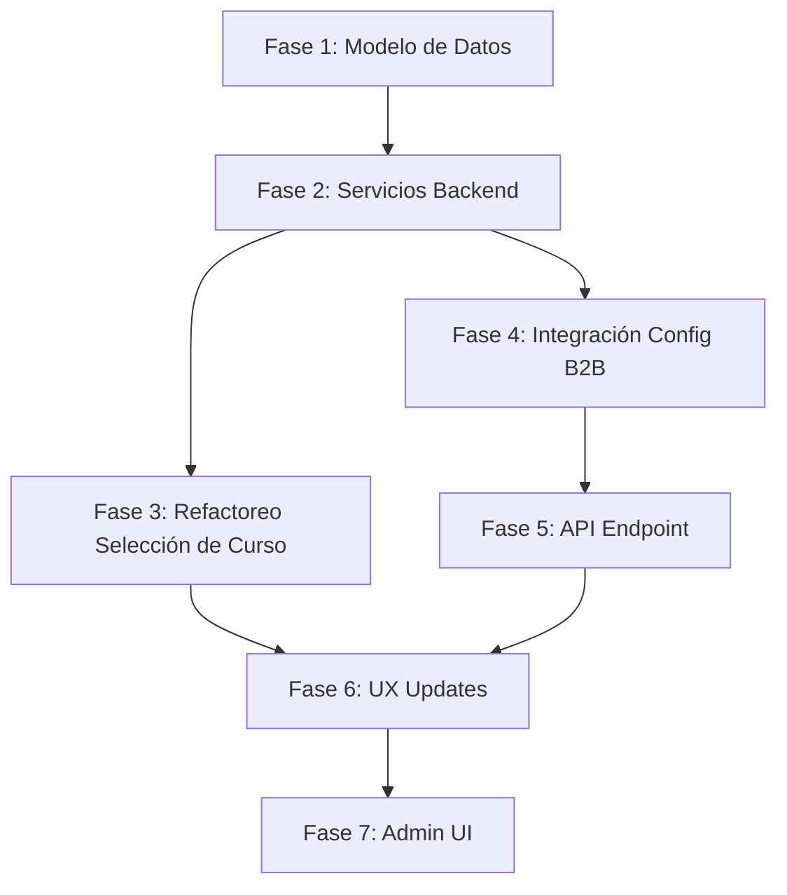

# Plan de Implementación — Planificador de Estudios v2 (Curso Individual)

> **Objetivo:** Refactorear el planificador para que opere sobre **un curso individual a la vez**, incorpore **configuración empresarial B2B** (horarios, festivos, ventanas), y corrija los bugs críticos identificados — todo sin tocar el modelo de Learning Paths (futuro).

---

## User Review Required

> [!IMPORTANT]
> **Decisiones pendientes que impactan la implementación:**
> 1. **Granularidad de configuración B2B** (RC-06): ¿La configuración de horarios laborales y festivos será solo a nivel organización, o necesita soportar equipo/zona/región desde el inicio? **Recomendación:** Implementar a nivel organización primero, con el modelo de datos preparado para granularidad futura.
> 2. **Pregunta Abierta #2**: ¿Se permite toma de cursos fuera de horario laboral? **Recomendación:** Sí permitirlo (el planificador solo *sugiere* dentro de horario laboral pero no bloquea).
> 3. **Pregunta Abierta #3**: ¿Grado exacto de flexibilidad del usuario dentro de la ventana organizacional? **Recomendación:** El sistema sugiere, el usuario decide cuándo dentro de la ventana inicio/fin.

> [!WARNING]
> **BUG-01 (pérdida de contexto al vincular Google/Microsoft):** Este bug requiere investigación del flujo OAuth y está fuera del alcance directo de esta refactorización del planificador. Se documenta aquí pero se resuelve como tarea independiente.

---

## Alcance In-Scope vs Out-of-Scope

### ✅ In-Scope (Esta Implementación)
| ID | Requerimiento |
|----|--------------|
| RF-01 | Planificación por curso individual |
| RF-02 | No planificar automáticamente todos los cursos |
| RF-03 | Paso explícito de selección de curso (uno a la vez) |
| RC-01–RC-05 | Configuración empresarial B2B (horarios, días, festivos, ventanas) |
| RC-07 | Separar ventana administrativa del momento exacto de estudio |
| RUX-01 | Cambiar mensaje inicial de SofLIA |
| RUX-02 | Separar "cursos asignados" vs "curso a planificar ahora" |
| RN-01–RN-04 | Reglas de negocio (microlearning, ventanas, flexibilidad, B2B) |
| BUG-02 | No planificar automáticamente todos los cursos |

### ❌ Out-of-Scope (Futuro)
| ID | Requerimiento |
|----|--------------|
| RF-04, RF-05–RF-09 | Learning Paths / Rutas de aprendizaje |
| RF-10–RF-12 | Asignación por olas/tandas (ya parcialmente resuelto) |
| RC-06 | Granularidad por estructura organizacional (preparar modelo, no implementar UI) |
| RUX-03–RUX-05 | Mejoras UX avanzadas de visualización |
| BUG-01 | Pérdida de contexto OAuth (tarea separada) |

---

## Propuestas de Cambio — Organizadas por Fase

### Fase 1: Modelo de Datos — Configuración Empresarial B2B

**Objetivo:** Crear las tablas necesarias para soportar configuración de horarios laborales, días hábiles, festivos y ventanas de inicio/fin por organización.

---

#### [NEW] `supabase/migrations/YYYYMMDD_organization_planner_config.sql`

Crear tabla `organization_planner_config` para almacenar la configuración B2B del planificador:

```sql
CREATE TABLE organization_planner_config (
  id UUID PRIMARY KEY DEFAULT gen_random_uuid(),
  organization_id UUID NOT NULL REFERENCES organizations(id) ON DELETE CASCADE,
  
  -- RC-01: Horarios laborales
  work_start_time TIME NOT NULL DEFAULT '09:00',
  work_end_time TIME NOT NULL DEFAULT '18:00',
  
  -- RC-02: Días de trabajo (0=Dom, 1=Lun, ..., 6=Sáb)
  work_days INTEGER[] NOT NULL DEFAULT '{1,2,3,4,5}',
  
  -- RC-05: Ventana de inicio/fin para cursos (por defecto abierta)
  default_course_start_offset_days INTEGER DEFAULT 0,
  default_course_duration_days INTEGER DEFAULT 30,
  
  -- RN-01: Configuración de microlearning
  max_lessons_per_day INTEGER DEFAULT 2,
  max_session_minutes INTEGER DEFAULT 60,
  
  -- Metadata
  timezone TEXT NOT NULL DEFAULT 'America/Mexico_City',
  created_at TIMESTAMPTZ DEFAULT NOW(),
  updated_at TIMESTAMPTZ DEFAULT NOW(),
  
  CONSTRAINT uq_org_planner_config UNIQUE (organization_id)
);

-- Índice
CREATE INDEX idx_org_planner_config_org ON organization_planner_config(organization_id);
```

#### [NEW] `supabase/migrations/YYYYMMDD_organization_holidays.sql`

Crear tabla `organization_holidays` para festivos oficiales + internos:

```sql
CREATE TABLE organization_holidays (
  id UUID PRIMARY KEY DEFAULT gen_random_uuid(),
  organization_id UUID NOT NULL REFERENCES organizations(id) ON DELETE CASCADE,
  
  -- RC-03/RC-04: Festivos oficiales e internos
  holiday_date DATE NOT NULL,
  name TEXT NOT NULL,
  type TEXT NOT NULL CHECK (type IN ('official', 'internal')),
  is_recurring BOOLEAN DEFAULT false,
  
  created_at TIMESTAMPTZ DEFAULT NOW(),
  
  CONSTRAINT uq_org_holiday UNIQUE (organization_id, holiday_date)
);

CREATE INDEX idx_org_holidays_org_date ON organization_holidays(organization_id, holiday_date);
```

#### [MODIFY] `organization_course_assignments` (existente)

Agregar campos para ventana administrativa (RC-05, RC-07):

```sql
ALTER TABLE organization_course_assignments
  ADD COLUMN IF NOT EXISTS start_date TIMESTAMPTZ,
  ADD COLUMN IF NOT EXISTS planning_window_start DATE,
  ADD COLUMN IF NOT EXISTS planning_window_end DATE;

COMMENT ON COLUMN organization_course_assignments.start_date IS 'Fecha desde la cual el curso está disponible para el usuario';
COMMENT ON COLUMN organization_course_assignments.planning_window_start IS 'Inicio de la ventana administrativa para planificación';
COMMENT ON COLUMN organization_course_assignments.planning_window_end IS 'Fin de la ventana administrativa para planificación';
```

> [!NOTE]
> `start_date` podría ya existir (ver migración `20251227_add_course_assignment_start_date.sql`). La migración usa `ADD COLUMN IF NOT EXISTS` para ser idempotente.

---

### Fase 2: Servicios Backend — Configuración Organizacional

**Objetivo:** Crear servicios que lean la configuración B2B y la expongan al planificador.

---

#### [NEW] `apps/web/src/features/study-planner/services/organization-planner-config.service.ts`

Servicio que obtiene y aplica la configuración del planificador por organización:

```typescript
// Responsabilidades:
// 1. getOrganizationPlannerConfig(orgId) → config con horarios, días, etc.
// 2. getOrganizationHolidays(orgId, dateRange) → festivos dentro de rango
// 3. isDateWithinPlanningWindow(assignment, date) → validación de ventana
// 4. getEffectiveWorkSchedule(orgId) → merge config org + defaults
```

**Interfaz propuesta:**

```typescript
export interface OrganizationPlannerConfig {
  workStartTime: string;    // "09:00"
  workEndTime: string;      // "18:00"
  workDays: number[];       // [1,2,3,4,5]
  maxLessonsPerDay: number;
  maxSessionMinutes: number;
  timezone: string;
  defaultCourseDurationDays: number;
}

export interface OrganizationHoliday {
  date: string;
  name: string;
  type: 'official' | 'internal';
}

export interface PlanningWindow {
  startDate: Date;
  endDate: Date;
  dueDate?: Date;
}
```

#### [MODIFY] [user-context.service.ts](file:///d:/Pulse%20Hub/SofLIA-Learning/apps/web/src/features/study-planner/services/user-context.service.ts)

Enriquecer el contexto del usuario con la configuración organizacional:
- Agregar `organizationPlannerConfig` al resultado de `getUserContext()`
- Para usuarios B2B, incluir la configuración de horarios y festivos de su organización

#### [MODIFY] [planner-welcome.service.ts](file:///d:/Pulse%20Hub/SofLIA-Learning/apps/web/src/features/study-planner/services/planner-welcome.service.ts)

Integrar festivos organizacionales con el sistema de festivos existente:
- Actualmente usa `HolidayService.getHolidaysInRange()` con festivos oficiales de MX
- Agregar los festivos internos de la organización al contexto
- Respetar horarios laborales en las restricciones de calendario

---

### Fase 3: Refactorización del Flujo de Selección de Curso (CORE)

**Objetivo:** Cambiar el flujo de "planificar todos los cursos" → "seleccionar y planificar un curso a la vez".

> [!IMPORTANT]
> Este es el cambio más crítico del proyecto. Resuelve directamente **BUG-02**, **RF-01**, **RF-02**, **RF-03**, **RUX-01** y **RUX-02**.

---

#### [MODIFY] [useStudyPlannerInitializationFlow.ts](file:///d:/Pulse%20Hub/SofLIA-Learning/apps/web/src/features/study-planner/hooks/useStudyPlannerInitializationFlow.ts)

**Cambio fundamental:** Actualmente el hook auto-selecciona TODOS los cursos asignados en la línea 82:
```typescript
// ANTES (líneas 81-84): Auto-selecciona todos
if (userData.assignedCourses.length > 0) {
  setSelectedCourseIds(
    userData.assignedCourses.map((course) => course.courseId).filter(Boolean),
  );
}
```

**Nuevo comportamiento:**
```typescript
// DESPUÉS: No auto-seleccionar, dejar vacío para que el usuario elija
// Los cursos asignados se cargan pero la selección es explícita
if (userData.assignedCourses.length > 0) {
  setSelectedCourseIds([]); // El usuario debe seleccionar explícitamente
}
```

#### [MODIFY] [useStudyPlannerWelcomeFlow.ts](file:///d:/Pulse%20Hub/SofLIA-Learning/apps/web/src/features/study-planner/hooks/useStudyPlannerWelcomeFlow.ts)

**Cambio:** El mensaje de bienvenida ya no debe asumir que se planifican todos los cursos.
- Modificar la lógica del `runWelcomeFlow` para que:
  1. Presente la lista de cursos asignados como **información** (no como selección automática)
  2. Pregunte al usuario **cuál curso quiere planificar ahora**
  3. Si solo hay un curso asignado, sugerirlo pero no auto-planificar
- Actualizar `setShowApproachButtons` para que no se muestre hasta después de seleccionar UN curso

#### [MODIFY] [planner-welcome.service.ts](file:///d:/Pulse%20Hub/SofLIA-Learning/apps/web/src/features/study-planner/services/planner-welcome.service.ts)

**Cambios en `buildWelcomeKickoffMessage()`:**

```diff
 'INSTRUCCIONES:',
 '1. Presentate como SofLIA, el asistente del Planificador de Estudios.',
 '2. Menciona brevemente que analizaste la informacion del usuario.',
-'5. Lista los cursos asignados y sus fechas limite si existen.',
-'6. Cierra preguntando que tipo de sesiones de estudio prefiere: rapidas, normales o largas.',
+'5. Lista los cursos asignados como informacion (NO los planifiques todos).',
+'6. Pregunta al usuario CUAL curso quiere planificar en este momento.',
+'7. Aclara que se planifica UN curso a la vez.',
```

#### [NEW] `apps/web/src/features/study-planner/components/CourseSelectionStep.tsx`

**Nuevo componente** que presenta la selección de curso individual:

```
┌──────────────────────────────────────────┐
│  📚 Tus cursos asignados                 │
│                                          │
│  ┌────────────────────────────────────┐  │
│  │ ✦ IA Esencial para Líderes        │  │
│  │   Fecha límite: 15 mayo 2026      │  │
│  │   Progreso: 0%                    │  │
│  │   [Planificar este curso →]       │  │
│  └────────────────────────────────────┘  │
│                                          │
│  ┌────────────────────────────────────┐  │
│  │   Liderazgo Digital               │  │
│  │   Fecha límite: 30 junio 2026     │  │
│  │   Progreso: 20%                   │  │
│  │   [Planificar este curso →]       │  │
│  └────────────────────────────────────┘  │
│                                          │
│  ┌────────────────────────────────────┐  │
│  │   Pensamiento Analítico           │  │
│  │   Sin fecha límite                │  │
│  │   Progreso: 0%                    │  │
│  │   [Planificar este curso →]       │  │
│  └────────────────────────────────────┘  │
│                                          │
│  💡 Se planifica un curso a la vez.      │
│     Al terminar, podrás planificar       │
│     el siguiente.                        │
└──────────────────────────────────────────┘
```

**Características del componente:**
- Muestra todos los cursos asignados con su estado
- Permite seleccionar **exactamente uno** (radio, no checkbox)
- Muestra indicadores de prioridad (fecha más próxima = sugerido)
- Incluye info de ventana organizacional si existe
- Si hay un plan activo para un curso, lo indica

#### [MODIFY] [useStudyPlannerCourseSelectionFlow.ts](file:///d:/Pulse%20Hub/SofLIA-Learning/apps/web/src/features/study-planner/hooks/useStudyPlannerCourseSelectionFlow.ts)

**Cambios críticos:**

1. `loadUserCourses()` — Cambiar de `/api/my-courses` a usar los cursos ya cargados en `assignedCourses` (evitar doble fetch)
2. `toggleCourseSelection()` — Cambiar de multi-select a single-select:
   ```typescript
   // ANTES: Agrega/quita de array
   // DESPUÉS: Reemplaza la selección completa
   const selectCourse = (courseId: string) => {
     setSelectedCourseIds([courseId]); // Solo un curso
   };
   ```
3. `confirmCourseSelection()` — Validar que exactamente un curso fue seleccionado
4. Eliminar los datos mock/fallback (líneas 90-93)

#### [MODIFY] [StudyPlannerCourseSelectorModal.tsx](file:///d:/Pulse%20Hub/SofLIA-Learning/apps/web/src/features/study-planner/components/StudyPlannerCourseSelectorModal.tsx)

- Cambiar de checkboxes a radio buttons (selección única)
- Agregar información de ventana organizacional por curso
- Mostrar indicador de "curso recomendado" (el que tiene la fecha más próxima)
- Actualizar copy de "Selecciona los cursos" → "¿Qué curso quieres planificar?"

---

### Fase 4: Integración de Config B2B en el Flujo del Planificador

**Objetivo:** El planificador debe respetar los horarios laborales, días hábiles y festivos de la organización al generar el plan.

---

#### [MODIFY] [validation.service.ts](file:///d:/Pulse%20Hub/SofLIA-Learning/apps/web/src/features/study-planner/services/validation.service.ts)

Agregar validaciones de configuración B2B:

```typescript
// Nuevas validaciones:
static validateAgainstOrgConfig(
  planConfig: StudyPlanConfig,
  orgConfig: OrganizationPlannerConfig,
): ValidationResult {
  // 1. Verificar que los días seleccionados están dentro de los días hábiles
  // 2. Verificar que los horarios caen dentro del horario laboral
  // 3. Verificar que no se excede max_lessons_per_day
  // 4. Verificar que no se excede max_session_minutes
}

static validatePlanningWindow(
  sessionDates: Date[],
  window: PlanningWindow,
): ValidationResult {
  // 1. Toda sesión debe caer dentro de la ventana
  // 2. Toda sesión debe completarse antes de due_date
}
```

#### [MODIFY] [planner-slot-analysis.service.ts](file:///d:/Pulse%20Hub/SofLIA-Learning/apps/web/src/features/study-planner/services/planner-slot-analysis.service.ts)

Filtrar slots disponibles usando la configuración organizacional:
- Excluir días no laborales según `workDays`
- Excluir festivos (oficiales + internos de la organización)
- Limitar horarios a `workStartTime` — `workEndTime`
- Respetar `maxLessonsPerDay`

#### [MODIFY] [planner-slot-selection.service.ts](file:///d:/Pulse%20Hub/SofLIA-Learning/apps/web/src/features/study-planner/services/planner-slot-selection.service.ts)

Incorporar restricciones del `OrganizationPlannerConfig`:
- Los slots seleccionados deben caer dentro de la ventana de planificación
- Los slots deben respetar horarios laborales para B2B

#### [MODIFY] [lesson-distribution.service.ts](file:///d:/Pulse%20Hub/SofLIA-Learning/apps/web/src/features/study-planner/services/lesson-distribution.service.ts)

Ajustar distribución para respetar `maxLessonsPerDay` de la organización y los horarios de la configuración.

#### [MODIFY] Prompt del planificador: [study-planner.prompt.rules.ts](file:///d:/Pulse%20Hub/SofLIA-Learning/apps/web/src/features/study-planner/prompts/study-planner.prompt.rules.ts) y [study-planner.prompt.template.ts](file:///d:/Pulse%20Hub/SofLIA-Learning/apps/web/src/features/study-planner/prompts/study-planner.prompt.template.ts)

Agregar al system prompt:
- Contexto de la configuración organizacional (horarios, festivos)
- Instrucción de que se planifica UN solo curso
- Contexto de la ventana administrativa (inicio/fin definido por la empresa)
- Instrucción de que el usuario tiene flexibilidad dentro de la ventana

---

### Fase 5: API — Endpoint de Configuración Organizacional

**Objetivo:** Exponer la configuración empresarial para administradores y para el planificador.

---

#### [NEW] `apps/web/src/app/api/study-planner/org-config/route.ts`

```typescript
// GET: Obtener configuración de la organización del usuario actual
// Usado por el flujo del planificador para obtener restricciones B2B

// Response:
{
  config: OrganizationPlannerConfig | null,
  holidays: OrganizationHoliday[],
  planningWindows: PlanningWindow[] // Por cada curso asignado
}
```

#### [MODIFY] [user-context/route.ts](file:///d:/Pulse%20Hub/SofLIA-Learning/apps/web/src/app/api/study-planner/user-context) (existente)

Enriquecer la respuesta del endpoint de contexto con la configuración organizacional B2B.

---

### Fase 6: UX — Actualización de Mensajes y Flujo Visual

**Objetivo:** Actualizar la interfaz para reflejar la nueva lógica de planificación individual.

---

#### [MODIFY] [StudyPlannerIntroOverlay.tsx](file:///d:/Pulse%20Hub/SofLIA-Learning/apps/web/src/features/study-planner/components/StudyPlannerIntroOverlay.tsx)

- Actualizar textos del overlay para reflejar planificación individual
- No mencionar "todos tus cursos"
- Presentar como "planifica tu siguiente curso"

#### [MODIFY] [StudyPlannerConversationShell.tsx](file:///d:/Pulse%20Hub/SofLIA-Learning/apps/web/src/features/study-planner/components/StudyPlannerConversationShell.tsx)

- Agregar indicador de "Planificando: [Nombre del Curso]" en el header
- Mostrar ventana organizacional si existe (ej: "Disponible del 1 al 30 de mayo")

#### [MODIFY] [StudyPlannerConversationHeader.tsx](file:///d:/Pulse%20Hub/SofLIA-Learning/apps/web/src/features/study-planner/components/StudyPlannerConversationHeader.tsx)

- Agregar badge con el nombre del curso activo en planificación

---

### Fase 7: Admin — Interfaz para Configuración B2B

> [!NOTE]
> Esta fase puede implementarse de forma simplificada inicialmente (solo los campos más críticos) y extenderse después.

---

#### [NEW] `apps/web/src/features/admin/components/PlannerConfigPanel.tsx`

Panel de administración para configurar:
- Horario laboral (inicio/fin)
- Días hábiles
- Festivos (CRUD)
- Límites (lecciones por día, duración máxima de sesión)
- Timezone

#### [NEW] `apps/web/src/features/admin/services/planner-config/`

Servicios CRUD para la configuración del planificador:
- `getOrgPlannerConfig(orgId)`
- `updateOrgPlannerConfig(orgId, config)`
- `getOrgHolidays(orgId)`
- `createOrgHoliday(orgId, holiday)`
- `deleteOrgHoliday(orgId, holidayId)`

---

## Tipos Actualizados

#### [MODIFY] [planner-ui.types.ts](file:///d:/Pulse%20Hub/SofLIA-Learning/apps/web/src/features/study-planner/types/planner-ui.types.ts)

```typescript
// Agregar al contexto del usuario:
export interface StudyPlannerUserContext {
  // ... campos existentes ...
  organizationPlannerConfig: OrganizationPlannerConfig | null;
}

// Agregar al tipo de curso asignado:
export interface StudyPlannerAssignedCourse {
  // ... campos existentes ...
  planningWindowStart: string | null;
  planningWindowEnd: string | null;
  hasActivePlan: boolean;
}
```

---

## Open Questions

> [!IMPORTANT]
> **Q1:** ¿La UI de administración de configuración B2B (Fase 7) se implementa ahora o se deja para una segunda iteración? Si la configuración se inyecta vía SQL directo inicialmente, podemos diferir la UI admin.

> [!IMPORTANT]
> **Q2:** ¿Hay cursos que actualmente estén siendo planificados con el flujo viejo (multi-curso)? Si sí, ¿se necesita una migración de planes existentes o se dejan como están y solo los nuevos usan el nuevo flujo?

> [!WARNING]
> **Q3:** El `StudyPlannerCourseSelectorModal.tsx` actual (14KB) tiene lógica compleja de multi-selección. ¿Preferimos refactorear ese modal o crear el componente `CourseSelectionStep.tsx` nuevo desde cero? **Recomendación:** Crear nuevo y desacoplar.

---

## Verification Plan

### Automated Tests

```bash
# Ejecutar tests existentes del planificador para detectar regresiones
npm run test -- --filter study-planner

# Tests específicos a agregar:
# 1. organization-planner-config.service.test.ts — CRUD de configuración
# 2. validation.service.test.ts — Nuevas validaciones B2B
# 3. useStudyPlannerInitializationFlow.test.ts — No auto-selección
# 4. planner-slot-analysis.service.test.ts — Filtrado por config org
```

### Browser Tests (Post-Implementación)

1. **Flujo B2B — Curso Individual:**
   - Abrir planificador con 3 cursos asignados
   - Verificar que NO se auto-planifican todos
   - Seleccionar UN solo curso
   - Completar flujo de planificación
   - Verificar que el plan solo tiene sesiones del curso seleccionado

2. **Restricciones Organizacionales:**
   - Con config de horario laboral 9:00-18:00, verificar que los slots sugeridos caen dentro
   - Con festivos configurados, verificar que esos días se excluyen
   - Con ventana de planificación cerrada, verificar que no se puede planificar

3. **Regresión B2C:**
   - Verificar que el flujo B2C (usuario sin organización) sigue funcionando normalmente

### Manual Verification

- Revisar que el mensaje de bienvenida de SofLIA no asume planificación total
- Verificar que la selección de curso es de radio (uno) no checkbox (múltiples)
- Confirmar que los festivos de la org aparecen en las restricciones de calendario

---

## Orden de Ejecución Recomendado



| Fase | Estimado | Riesgo | Dependencias |
|------|----------|--------|--------------|
| 1. Modelo de Datos | 1-2h | Bajo | Ninguna |
| 2. Servicios Backend | 2-3h | Bajo | Fase 1 |
| 3. Selección de Curso (CORE) | 4-6h | **Alto** | Fase 2 |
| 4. Integración Config B2B | 3-4h | Medio | Fase 2 |
| 5. API Endpoint | 1-2h | Bajo | Fase 2, 4 |
| 6. UX Updates | 2-3h | Medio | Fase 3, 5 |
| 7. Admin UI (diferible) | 4-6h | Bajo | Fase 1, 2 |

> **Total estimado:** 17-26 horas de desarrollo (sin Fase 7: 13-20 horas)

---

## Archivos Impactados (Resumen)

| Acción | Archivo | Componente |
|--------|---------|-----------|
| NEW | `supabase/migrations/YYYYMMDD_organization_planner_config.sql` | DB |
| NEW | `supabase/migrations/YYYYMMDD_organization_holidays.sql` | DB |
| MODIFY | `organization_course_assignments` (migración) | DB |
| NEW | `services/organization-planner-config.service.ts` | Backend |
| MODIFY | `services/user-context.service.ts` | Backend |
| MODIFY | `services/planner-welcome.service.ts` | Backend |
| MODIFY | `services/validation.service.ts` | Backend |
| MODIFY | `services/planner-slot-analysis.service.ts` | Backend |
| MODIFY | `services/planner-slot-selection.service.ts` | Backend |
| MODIFY | `services/lesson-distribution.service.ts` | Backend |
| NEW | `components/CourseSelectionStep.tsx` | Frontend |
| MODIFY | `components/StudyPlannerCourseSelectorModal.tsx` | Frontend |
| MODIFY | `components/StudyPlannerIntroOverlay.tsx` | Frontend |
| MODIFY | `components/StudyPlannerConversationShell.tsx` | Frontend |
| MODIFY | `components/StudyPlannerConversationHeader.tsx` | Frontend |
| MODIFY | `hooks/useStudyPlannerInitializationFlow.ts` | Frontend |
| MODIFY | `hooks/useStudyPlannerWelcomeFlow.ts` | Frontend |
| MODIFY | `hooks/useStudyPlannerCourseSelectionFlow.ts` | Frontend |
| MODIFY | `prompts/study-planner.prompt.rules.ts` | Prompts |
| MODIFY | `prompts/study-planner.prompt.template.ts` | Prompts |
| MODIFY | `types/planner-ui.types.ts` | Types |
| NEW | `api/study-planner/org-config/route.ts` | API |
| NEW | `admin/components/PlannerConfigPanel.tsx` | Admin (diferible) |
| NEW | `admin/services/planner-config/` | Admin (diferible) |
